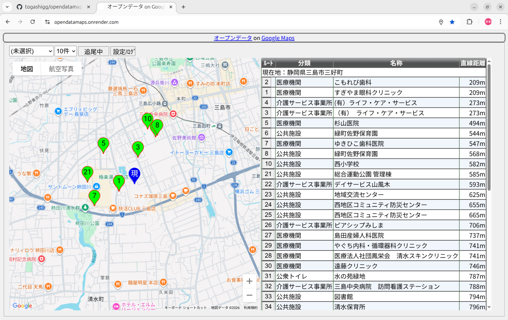
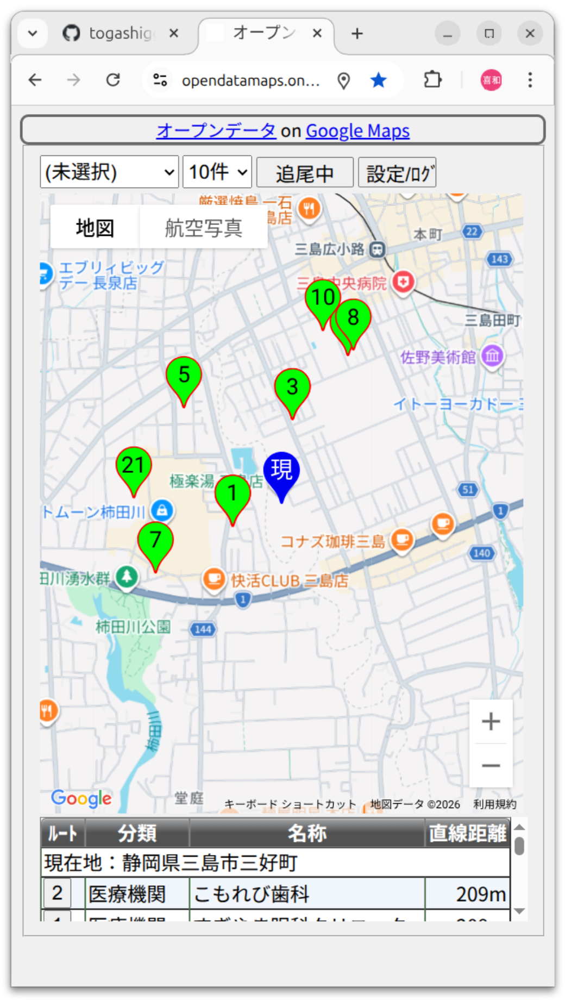

# オープンデータ施設情報取得API
<DIV STYLE="width: 100%; text-align: right;">2026年○月○○日 ○○の日 公開</DIV>

## 目次

  * [1.概要](#1概要)
  * [2.収集済のオープンデータ](#2収集済のオープンデータ)
  * [3.施設種別](#3施設種別)
  * [4.機能](#4機能)
  * [5.Web_APIの構文](#5Web_APIの構文)
  * [6.対象：市区町村情報](#6対象市区町村情報)
  * [7.対象：施設情報](#7対象施設情報)
  * [8.Renderでの構築手順（※作成者メモ）](#8Renderでの構築手順作成者メモ)
  * [9.Dockerコンテナで運用する](#9Dockerコンテナで運用する)
  * [10.使用サービスおよび使用ソフトウェアのライセンスおよびポリシー](#10使用サービスおよび使用ソフトウェアのライセンスおよびポリシー)

## 1.概要

　近年オープンデータが各都道府県および市区町村により公開されていることは、多くの方がご存じのことと思います。
  また、オープンデータの中には地理上の座標や住所を含む情報があり、これらの情報は地図上に表示することが可能です。
  これらのオープンデータの中で個人的に最も重宝している情報は公衆トイレの情報です。その理由は街中を歩くことが多いためです。
  また、市区町村単位で情報が公開されているため、市区町村の境界近くでは欲しい情報を得るのがめんどうなことがあります。
  こんな状況を解決するために、各市区町村にまたがった情報を一括して取得できるようにできないかと考えました。

　結論として、各市区町村が公開しているオープンデータの中でも座標や住所を公開している情報に着目してデータベース化することと、
現在地から近い施設（半径何メートル以内？）を抽出するWebAPIを提供することで解決できるのではないかと考えました。

　スマホが復旧した現在では、Webブラウザを使用することで現在地が簡単に取得でき、周囲の施設を検索してGoogle Maps等で簡単に表示できます。
  その際、特定の施設等の固定的な座標から、周囲の施設を検索することもできます。

　また、オープンデータは、[e-Gov](https://data.e-gov.go.jp/)や[e-Stat](https://www.e-stat.go.jp/)が決めた分野（カテゴリ）に分類されて公開されています。
分野とは、 国土・気象、人口・世帯、労働・賃金、農林水産業、鉱工業、商業・サービス業、企業・家計・経済、住宅・土地・建設、エネルギー・水、運輸・観光、情報通信・科学技術、教育・文化・スポーツ・生活、行財政、司法・安全・環境、社会保障・衛生、国際、等が定義されています。
例えば、利用者目線の「公衆トイレ」の情報は「教育・文化・スポーツ・生活」分野に含まれているようです。
この分野は、地図上に表示するラベルとしては使いづらいため、独自の手法で種別を設定するようにしました。
種別の詳細については、後述の「施設種別」を参照してください。

　実際に取得したオープンデータをGoogleマップ上に表示するサンプルを作成しましたので、以下のリンクから確認してみて下さい。※作業中で停止していたらごめんなさい。 m(\_.\_)m

  - <A HREF="https://opendatamaps.onrender.com/" TARGET="_blank" REL="noopener">オープンデータ on Google Maps</A>

　実際の画面例がこちらです。
  
  

　実際に見てみると多くの施設情報が公開されていると感じます。

　後述のWebAPIの例を参考にして楽しんで頂ければ幸いです。また、サンプルでは、実際に使用したAPIのログを確認できますので、一助になれば幸いです。

　まだまだ不完全な部分が多いですが、ぼちぼち改善していきたいと考えています。

　公開に際しては以下のサービスを使用させて頂きました。感謝致します。

  - [Google Maps](https://mapsplatform.google.com/)
  - [Render](https://render.com/)
  - [GitHub](https://github.com/)
  - [Docker Hub](https://hub.docker.com/)

　作成に際しては以下のソフトウェアを使用させて頂きました。感謝致します。

  - [Ubuntu 24.04](https://ubuntu.com/)
  - [Python 3.12](https://www.python.org/)
  - [requests](https://requests.readthedocs.io/en/latest/)
  - [BeautifulSoup](https://www.crummy.com/software/BeautifulSoup/)
  - [PostgreSQL](https://www.postgresql.org/)

## 2.収集済のオープンデータ

　オープンデータは、都道府県および市区町村単位で公開されていますが、各市区町村のオープンデータを調査するには、
大変な労力が必要と考えています。そのため、市区町村のデータを含めて都道府県が公開しているオープンデータを対象とすることにしました。
　収集方法は、APIとして[CKAN](https://data.e-gov.go.jp/data/api_guide)または[シラサギ](https://www.ss-proj.org/)をサポートしているところのみを対象としました。

　また、小さく始めるために、最初に静岡県を対象として開発し、次いで東京都へと適用しました。
随時、他の道府県への適用を進めています。

　以下の表は、「デジタル庁」が公開している「[オープンデータ取組済自治体資料](https://www.digital.go.jp/resources/data_local_governments)」を参考にして、
現在までに収集済の都道府県を以下の表にまとめました。一部は、都道府県単位では収集できなかったため、市区町村単位に収集したところもあります。
  |団体コード |団体名 |☆取得 |☆API |サイトのURL1 |サイトのURL2 |サイトのURL3 |初回登録日 |更新日 |☆備考 |
  |---------|------|-----|-----|------------|------------|------------|---------|------|---- |
  |010006 |北海道   |−   |−   |<A HREF="http://www.pref.hokkaido.lg.jp/ss/jsk/opendata/opendata.htm" TARGET="_blank" REL="noopener">サイト1</A> |<A HREF="https://www.harp.lg.jp/opendata/" TARGET="_blank" REL="noopener">サイト2</A> | | | |     |
  |014257 |北海道<BR>上砂川町 |○    |[CKAN](https://data.bodik.jp/api/3/action/package_search?facet.limit=-1&facet.field=["name"]&fq=name:014257_*&sort=&rows=0) |<A HREF="https://odcs.bodik.jp/014257/" TARGET="_blank" REL="noopener">サイト1</A> |     |     | | |name:014257_*を抽出 |
  |020001 |青森県   |○   |[シラサギ](https://opendata.pref.aomori.lg.jp/api/package_list?limit=0&offset=0) |<A HREF="https://opendata.pref.aomori.lg.jp/" TARGET="_blank" REL="noopener">サイト1</A> | | | |2019/3/11 |取得は約100件／日 |
  |030007 |岩手県   |−   |−   |<A HREF="https://www.pref.iwate.jp/opendata/" TARGET="_blank" REL="noopener">サイト1</A> | | | |2024/2/6 |     |
  |040002 |宮城県   |○   |[CKAN](https://miyagi.dataeye.jp/ckan_api/package_list?limit=9999) |<A HREF="http://www.pref.miyagi.jp/site/opendata-miyagi/" TARGET="_blank" REL="noopener">サイト1</A> |<A HREF="https://miyagi.dataeye.jp/" TARGET="_blank" REL="noopener">サイト2</A> | | |2022/11/7 |     |
  |050008 |秋田県   |○   |[CKAN](https://ckan.pref.akita.lg.jp/api/3/action/package_list) |<A HREF="https://www.pref.akita.lg.jp/pages/archive/32419" TARGET="_blank" REL="noopener">サイト1</A> |<A HREF="https://opendata.pref.akita.lg.jp/" TARGET="_blank" REL="noopener">サイト2</A> | | |2024/9/27 |     |
  |060003 |山形県   |−   |−   |<A HREF="http://www.pref.yamagata.jp/ou/kikakushinko/020051/opendata.html" TARGET="_blank" REL="noopener">サイト1</A> | | | | |     |
  |070009 |福島県   |−   |−   |<A HREF="https://www.pref.fukushima.lg.jp/sec/11045a/open-data-top.html" TARGET="_blank" REL="noopener">サイト1</A> | | | | |     |
  |080004 |茨城県   |−   |−   |<A HREF="http://www.pref.ibaraki.jp/kikaku/joho/it/opendata/od-00.html" TARGET="_blank" REL="noopener">サイト1</A> | | | | |     |
  |090000 |栃木県   |○   |[CKAN](https://data.bodik.jp/api/3/action/package_search?facet.limit=-1&facet.field=["name"]&fq=name:09*&sort=&rows=0) |<A HREF="http://tochigiken.jp/" TARGET="_blank" REL="noopener">サイト1</A> | | | | |name:09*を抽出 |
  |100005 |群馬県   |−   |−   |<A HREF="https://www.pref.gunma.jp/07/b2700057.html" TARGET="_blank" REL="noopener">サイト1</A> | | | | |     |
  |110001 |埼玉県   |○   |[CKAN](https://opendata.pref.saitama.lg.jp/ckan_api/package_list?limit=100&offset=0) |<A HREF="https://opendata.pref.saitama.lg.jp/" TARGET="_blank" REL="noopener">サイト1</A> | | | | |     |
  |120006 |千葉県   |−   |−   |<A HREF="https://www.pref.chiba.lg.jp/gyoukaku/opendata/index.html" TARGET="_blank" REL="noopener">サイト1</A> | | | |2022/3/3 |     |
  |122041 |千葉県<BR>船橋市 |○   |[CKAN](https://data.bodik.jp/api/3/action/package_search?facet.limit=-1&facet.field=["name"]&fq=name:122041_*&sort=&rows=0) |<A HREF="https://odcs.bodik.jp/122041/" TARGET="_blank" REL="noopener">サイト1</A> | | | | |name:122041_*を抽出 |
  |130001 |東京都   |○   |[CKAN](https://catalog.data.metro.tokyo.lg.jp/api/3/action/package_list?limit=0) |<A HREF="http://opendata-portal.metro.tokyo.jp/www/index.html" TARGET="_blank" REL="noopener">サイト1</A> |<A HREF="http://www.koho.metro.tokyo.jp/opendata/" TARGET="_blank" REL="noopener">サイト2</A> | | | |     |
  |140007 |神奈川県 |△   |[CKAN](https://catalog.opendata.pref.kanagawa.jp/api/3/action/package_list?limit=0) |<A HREF="http://www.pref.kanagawa.jp/cnt/f534212/" TARGET="_blank" REL="noopener">サイト1</A> | | | | |施設情報に座標無し |
  |141003 |神奈川県<BR>横浜市 |○   |[CKAN](https://data.city.yokohama.lg.jp/api/3/action/package_list?limit=0) |<A HREF="https://data.city.yokohama.lg.jp/" TARGET="_blank" REL="noopener">サイト1</A> | | | | |     |
  |150002 |新潟県   |−   |−   |<A HREF="https://www.pref.niigata.lg.jp/site/opendata/" TARGET="_blank" REL="noopener">サイト1</A> | | | |2022/12/15 |     |
  |160008 |富山県   |○   |[CKAN](https://opendata.pref.toyama.jp/api/3/action/package_list?limit=0) |<A HREF="http://opendata.pref.toyama.jp/" TARGET="_blank" REL="noopener">サイト1</A> | | | | |     |
  |170003 |石川県   |○   |[CKAN](https://ckan.opendata.pref.ishikawa.lg.jp/api/3/action/package_list?limit=0) |<A HREF="https://www.pref.ishikawa.lg.jp/opendata/" TARGET="_blank" REL="noopener">サイト1</A> | | | | |     |
  |180009 |福井県   |−   |−   |<A HREF="http://www.pref.fukui.lg.jp/doc/toukei-jouhou/opendata/" TARGET="_blank" REL="noopener">サイト1</A> | | | | |     |
  |190004 |山梨県   |−   |−   |<A HREF="https://www.pref.yamanashi.jp/opendata/" TARGET="_blank" REL="noopener">サイト1</A> | | | | |     |
  |200000 |長野県   |−   |−   |<A HREF="https://wwwgis.pref.nagano.lg.jp/pref-nagano/OpenData" TARGET="_blank" REL="noopener">サイト1</A> | | | |2022/11/7 |     |
  |210005 |岐阜県   |○   |[CKAN](https://gifu-opendata.pref.gifu.lg.jp/api/3/action/package_list?limit=0) |<A HREF="https://gifu-opendata.pref.gifu.lg.jp/" TARGET="_blank" REL="noopener">サイト1</A> | | | | |     |
  |220001 |静岡県   |○   |[シラサギ](https://opendata.pref.shizuoka.jp/api/package_list?limit=0) |<A HREF="https://opendata.pref.shizuoka.jp/" TARGET="_blank" REL="noopener">サイト1</A> | | | | |     |
  |230006 |愛知県   |−   |−   |<A HREF="https://www.pref.aichi.jp/life/7/" TARGET="_blank" REL="noopener">サイト1</A> |<A HREF="http://www.e-aichi.jp/cgi-bin/jump.cgi?http://www.e-aichi.jp/opendata.html" TARGET="_blank" REL="noopener">サイト2</A> | | |2020/1/30 |     |
  |240001 |三重県   |○   |[CKAN](https://data.bodik.jp/api/3/action/package_search?facet.limit=-1&facet.field=["name"]&fq=name:24*&sort=&rows=0) |<A HREF="http://www.pref.mie.lg.jp/IT/HP/87579000001.htm" TARGET="_blank" REL="noopener">サイト1</A> | | | | |name:24*を抽出 |
  |250007 |滋賀県   |−   |−   |<A HREF="https://www.pref.shiga.lg.jp/ippan/kurashi/ict/300004.html" TARGET="_blank" REL="noopener">サイト1</A> | | | | |     |
  |260002 |京都府   |○   |[CKAN](https://data.bodik.jp/api/3/action/package_search?facet.limit=-1&facet.field=["name"]&fq=name:26*&sort=&rows=0) |<A HREF="http://www.pref.kyoto.jp/digital/opendata/index.html" TARGET="_blank" REL="noopener">サイト1</A> |<A HREF="https://odcs.bodik.jp/260002/" TARGET="_blank" REL="noopener">サイト2</A> | | |2022/1/12 |name:26*を抽出 |
  |270008 |大阪府   |○   |[CKAN](https://data.bodik.jp/api/3/action/package_search?facet.limit=-1&facet.field=["name"]&fq=name:27*&sort=&rows=0) |<A HREF="http://www.pref.osaka.lg.jp/kikaku_keikaku/opendata/index.html" TARGET="_blank" REL="noopener">サイト1</A> | | | | |name:27*を抽出 |
  |280003 |兵庫県   |−   |−   |<A HREF="https://web.pref.hyogo.lg.jp/opendata/index.php" TARGET="_blank" REL="noopener">サイト1</A> | | | |2022/3/18 |     |
  |290009 |奈良県   |−   |−   |<A HREF="http://www.pref.nara.jp/44954.htm" TARGET="_blank" REL="noopener">サイト1</A> | | | | |     |
  |300004 |和歌山県 |○   |[CKAN](https://data.bodik.jp/api/3/action/package_search?facet.limit=-1&facet.field=["name"]&fq=name:30*&sort=&rows=0) |<A HREF="https://www.pref.wakayama.lg.jp/prefg/020400/opendata/d00207954.html" TARGET="_blank" REL="noopener">サイト1</A> |<A HREF="https://odcs.bodik.jp/300004/" TARGET="_blank" REL="noopener">サイト2</A> | | |2021/9/6 |name:30*を抽出 |
  |310000 |鳥取県   |−   |−   |<A HREF="https://odp-pref-tottori.tori-info.co.jp/" TARGET="_blank" REL="noopener">サイト1</A> | | | | |     |
  |320005 |島根県   |○   |[CKAN](https://shimane-opendata.jp/ckan_api/package_list?limit=9999) |<A HREF="https://shimane-opendata.jp/" TARGET="_blank" REL="noopener">サイト1</A> | | | | |     |
  |330001 |岡山県   |○   |[CKAN](https://www.okayama-opendata.jp/ckan_api/package_list?limit=9999) |<A HREF="http://www.okayama-opendata.jp/" TARGET="_blank" REL="noopener">サイト1</A> | | | | |     |
  |340006 |広島県   |−   |−   |<A HREF="https://www.pref.hiroshima.lg.jp/soshiki/265/opendata.html" TARGET="_blank" REL="noopener">サイト1</A> |<A HREF="https://hiroshima-opendata.dataeye.jp" TARGET="_blank" REL="noopener">サイト2</A> | | |2022/4/13 |     |
  |350001 |山口県   |○   |[CKAN](https://yamaguchi-opendata.jp/ckan/api/3/action/package_list?limit=0) |<A HREF="https://yamaguchi-opendata.jp/www/" TARGET="_blank" REL="noopener">サイト1</A> | | | | |     |
  |360007 |徳島県   |○   |[シラサギ](https://opendata.pref.tokushima.lg.jp/api/package_list?limit=0)|<A HREF="https://opendata.pref.tokushima.lg.jp/" TARGET="_blank" REL="noopener">サイト1</A> | | | |2022/6/16 |     |
  |370002 |香川県   |−   |−   |<A HREF="https://opendata.pref.kagawa.lg.jp/" TARGET="_blank" REL="noopener">サイト1</A> | | | | |     |
  |380008 |愛媛県   |○   |[シラサギ](https://www.pref.ehime.jp/opendata-catalog/api/package_list?limit=0&offset=0) |<A HREF="https://www.pref.ehime.jp/opendata-catalog/" TARGET="_blank" REL="noopener">サイト1</A> | | | |2020/1/30 |     |
  |390003 |高知県   |−   |−   |<A HREF="http://www.pref.kochi.lg.jp/opendata/" TARGET="_blank" REL="noopener">サイト1</A> | | | | |     |
  |400009 |福岡県   |○   |[CKAN](https://data.bodik.jp/api/3/action/package_search?facet.limit=-1&facet.field=["name"]&fq=name:40*&sort=&rows=0) |<A HREF="https://www.open-governmentdata.org/fukuoka-pref/" TARGET="_blank" REL="noopener">サイト1</A> | | | | |name:40*を抽出 |
  |410004 |佐賀県   |○   |[CKAN](https://data.bodik.jp/api/3/action/package_search?facet.limit=-1&facet.field=["name"]&fq=name:41*&sort=&rows=0) |<A HREF="http://odcs.bodik.jp/410004/" TARGET="_blank" REL="noopener">サイト1</A> | | | | |name:41*を抽出 |
  |420000 |長崎県   |○   |[CKAN](https://data.bodik.jp/api/3/action/package_search?facet.limit=-1&facet.field=["name"]&fq=name:42*&sort=&rows=0) |<A HREF="http://odcs.bodik.jp/420000/" TARGET="_blank" REL="noopener">サイト1</A> | | | | |name:42*"を抽出 |
  |430005 |熊本県   |○   |[CKAN](https://data.bodik.jp/api/3/action/package_search?facet.limit=-1&facet.field=["name"]&fq=name:43*&sort=&rows=0) |<A HREF="http://www.pref.kumamoto.jp/kiji_22038.html" TARGET="_blank" REL="noopener">サイト1</A> | | | | |name:43*を抽出 |
  |440001 |大分県   |○   |[CKAN](https://data.bodik.jp/api/3/action/package_search?facet.limit=-1&facet.field=["name"]&fq=name:44*&sort=&rows=0) |<A HREF="https://www.pref.oita.jp/soshiki/11840/opendata.html" TARGET="_blank" REL="noopener">サイト1</A> |<A HREF="https://odcs.bodik.jp/440001/" TARGET="_blank" REL="noopener">サイト2</A> | |2025/9/3 | |name:44*を抽出 |
  |450006 |宮崎県   |○   |[CKAN](https://data.bodik.jp/api/3/action/package_search?facet.limit=-1&facet.field=["name"]&fq=name:45*&sort=&rows=0) |<A HREF="https://odcs.bodik.jp/450006/" TARGET="_blank" REL="noopener">サイト1</A> | | |2019/6/17 | |name:45*を抽出 |
  |460001 |鹿児島県 |○   |[CKAN](https://data.bodik.jp/api/3/action/package_search?facet.limit=-1&facet.field=["name"]&fq=name:46*&sort=&rows=0) |<A HREF="http://www.pref.kagoshima.jp/ac03/infra/info/opendata/" TARGET="_blank" REL="noopener">サイト1</A> | | | | |name:46*を抽出 |
  |470007 |沖縄県   |○   |[CKAN](https://data.bodik.jp/api/3/action/package_search?facet.limit=-1&facet.field=["name"]&fq=name:47*&sort=&rows=0) |<A HREF="https://www.pref.okinawa.lg.jp/site/kikaku/joho/kikaku/opendata/opendata.html" TARGET="_blank" REL="noopener">サイト1</A> | | | | |name:47*を抽出 |

  ☆：追加項目です。


## 3.施設種別

　施設種別とは、e-Govやe-Statで定めた分野（カテゴリ）とは異なり、日常的に使い慣れた施設の種別を独自に定義しました。

　現在、施設種別は、オープンデータのデータセット名から正規表現により、以下のような種別を定義しています。
  |施設種別         |データセット名から施設種別を決定する正規表現            |
  |----------------|------------------------------------------------|
  |AED設置箇所      |"(AED\|ＡＥＤ)" |
  |介護サービス事業所 |"介護"        |
  |医療機関         |"(病院\|医療[^品]\|医院\|歯科\|助産所\|健診\|応急救護\|施術所\|診療所)" |
  |薬局            |"(薬局\|医薬品\|医療品)" |
  |文化財           |"文化財" |
  |観光施設・場所    |"(観光(施設\|場所\|情報\|マップ)\|名所\|眺望\|見所\|ブランド\|るるぶ\|野外彫刻\|撮影スポット)" |
  |公衆無線LAN      |"((公衆\|公共)?無線(LAN\|ＬＡＮ)\|公衆無線\|Wi\\-?[Ff]i\|Ｗｉ−?[Ｆｆ]ｉ)" |
  |公衆トイレ       |"(トイレ\|便所)" |
  |消防水利施設      |"(消防水利施設\|消火栓\|防火水槽)" |
  |消防            |"消防(署\|団\|施設)" |
  |指定緊急避難場所  |"(津波\|緊急避難)" |
  |避難所           |"避難(所\|地\|場所)" |
  |防災            |"(防災\|救護所\|同報無線\|飲料水\|ヨウ素剤\|ため池\|河川カメラ\|観測所)" |
  |公共施設         |"((市\|区\|町\|村\)役所\|(都\|道\|府\|県\|市\|区\|町\|村)(の\|内)(施設\|機関)\|庁舎\|公共施設\|自治体\|施設情報\|文化\|教養\|スポーツ\|公民館\|集会所\|公会堂\|(都\|道\|府\|県\|市\|区\|町\|村)民会館\|図書館\|文化施設\|(都\|道\|府\|県\|市\|区\|町\|村)営住宅\|斎場\|墓地\|環境施設\|焼却施設\|し尿処理\|衛生検査)" |
  |子ども食堂       |"[こ子]ども食堂" |
  |子育て施設       |"子育て" |
  |学校・保育施設    |"(学校\|こども園\|幼稚園\|保育\|児童館\|保育施設\|保育所\|放課後)" |
  |駐車場           |"駐車場" |
  |駐輪場           |"駐輪場" |
  |公園・花壇       |"(公園\|花壇)" |
  |公衆浴場         |"(公衆浴場\|入浴\|足湯)" |
  |投票所           |"投票所" |
  |福祉施設         |"(老人ホーム\|生活支援ハウス\|交流センター\|高齢者相談センター\|地域包括支援センター)" |
  |健康            |"(健康\|厚生)" |
  |飲食店・販売店    |"(認定店\|飲食店\|直売所)" |
  |保護保存樹木林等  |"(保護\|保存)(指定)?(樹木\|樹林\|生け垣)" |

　施設種別および施設種別を決定する正規表現は、随時改良する予定です。

## 4.機能

　以下の機能をWeb APIとして提供します。
  - 市区町村情報一覧取得
  - 施設種別取得
  - 施設情報取得
  - 施設検索

　機能の詳細は、次章以降で説明します。

## 5.Web_APIの構文

  ```
  https://{ホスト名}/{公開名/}api/{対象}/{機能名}[{手法名}][?パラメタ名=パラメタ値[&パラメタ名=パラメタ値...]]
  ```
  - ホスト名：サーバを特定するためのDNSで解決できるドメイン名またはIPアドレスを指定します。
  - 公開名：サーバ上で機能を特定するための名称（パス）を指定します。
  - 対象：localitycode（市区町村コード）またはfacility（施設）を指定します。
  - 機能名：対象毎に以下の機能名を指定します。
    |対象         |機能名  |機能             |機能概要                            |
    |------------|-------|-----------------|----------------------------------|
    |localitycode|query  |市区町村情報一覧取得|市区町村情報一覧を取得する             |

    |対象         |機能名  |機能             |機能概要                            |
    |------------|-------|-----------------|----------------------------------|
    |facility    |kinds  |施設種別取得       |施設種別を取得する                    |
    |            |summary|施設情報取得       |市区町村毎および施設種別毎の情報を取得する|
    |            |query  |施設検索          |条件に該当する施設検索を行い取得する     |
  - 手法名：施設検索を行う場合に以下の検索手法を指定します。
    |対象     |機能名 |手法名       |手法              |手法概要                           |
    |--------|------|------------|------------------|---------------------------------|
    |facility|query |center      |中心座標からの距離指定|中心座標から指定距離以内の施設を検索する|
    |        |      |localitycode|市区町村コード指定   |市区町村コードにより施設を検索する     |
  - パラメタ名=パラメタ値：施設検索を行う場合に以下の検索条件を指定します。
    |対象         |機能名 |手法名|指定|パラメタ名     |パラメタ値                        |
    |------------|------|-----|----|--------------|--------------------------------|
    |localitycode|query |ー   |    |code          |市区町村コードを指定する             |
    |            |      |     |    |state_name    |都道府県名を指定する                |
    |            |      |     |    |locality_name |市区町村名を指定する                |
    |            |      |     |    |limit         |取得する件数の上限を指定する         |

    |対象      |機能名  |手法名       |指定|パラメタ名 |パラメタ値                         |
    |---------|-------|------------|----|----------|---------------------------------|
    |facility |kinds  |ー          |    |code      |取得対象の市区町村コードを指定する（複数指定可能）|
    |         |summary|ー          |    |なし       |指定できるパラメタは無し                     |
    |         |query  |center      |必須|lat       |中心座標の緯度を指定する                      |
    |         |       |            |必須|lng       |中心座標の経度を指定する                      |
    |         |       |            |必須|distance  |中心座標からの距離を指定する（単位はメートル）    |
    |         |       |            |    |kind      |取得する施設種別を指定する（複数指定可能）      |
    |         |       |            |    |limit     |取得する件数の上限を指定する                  |
    |         |       |localitycode|必須|code       |市区町村コードを指定する（複数指定可能）        |
    |         |       |            |    |kind      |取得する施設種別を指定する（複数指定可能）      |
    |         |       |            |    |limit     |取得する件数の上限を指定する                  |

## 6.対象：市区町村情報

　「総務省」の「全国地方公共団体コード」ページで「[都道府県コード及び市区町村コード](https://www.soumu.go.jp/denshijiti/code.html)」が公開されています。
この中の「コード一覧表」の最新の「Excelファイル」をダウンロードして、２つのシートをCSV形式に変換して結合したファイルを内包しています。
このコード一覧表をデータベースに登録して取得できるようにしています。

### 6.1 機能：市区町村情報一覧取得

　Web APIの構文

  ```
  https://{ホスト名}/{公開名/}api/localitycode/query
       [?[[&]code=市区町村コード]
         [[&]state_name=都道府県名]
         [[&]locality_name=市区町村名]
         [[&]limit=取得件数の上限]
       ]
  ```
  - 機能

    市区町村情報一覧を取得します。市区町村情報には、市区町村コード、都道府県名、市区町村名が含まれます。
    パラメタとして検索条件（市区町村コード、都道府県名、市区町村名）と取得件数の上限を指定できます。
  - パラメタ
    - code=市区町村コード

      市区町村コードを前方一致条件で検索する場合に指定します。
      用途としては、
      都道府県コードを指定して都道府県内の市区町村コード一覧を取得する場合や、
      市区町村コードを指定して都道府県名および市区町村名を取得する場合を想定しています。
    - state_name=都道府県名

      都道府県名を条件として検索する場合に指定します。
      用途としては、
      都道府県名を指定して都道府県内の市区町村コード一覧を取得する場合を想定しています。
    - locality_name=市区町村名

      市区町村名を指定して市区町村情報を検索する場合に指定します。
      用途としては、
      市区町村名を指定して都道府県名および市区町村コードを取得する場合を想定しています。
    - limit=取得件数の上限

      取得する件数の上限を「0」または正の整数で指定します。上限なしを指定する場合に「0」を指定します。
      本パラメタを省略した場合の上限は100件です。
  - 取得結果

    以下のJSON形式で返却します。
    ```
    [
      {"code": "＜都道府県・市区町村コード＞", "state_name": "＜都道府県名＞", "locality_name": "市区町村名"}
      ［,{"code": "＜都道府県・市区町村コード＞", "state_name": "＜都道府県名＞", "locality_name": "市区町村名"}
      ［, ・・・ ］］
    ]
    ```
  - 例

    1 <A HREF="https://opendatamaps.onrender.com/api/localitycode/query" TARGET="_blank" REL="noopener">https://{ホスト名}/{公開名/}api/localitycode/query</A>
      <details>
      <summary>出力例</summary>

      [{"code": "010006", "state_name": "北海道", "locality_name": ""},
      {"code": "011002", "state_name": "北海道", "locality_name": "札幌市"},
      {"code": "011011", "state_name": "北海道", "locality_name": "札幌市中央区"},
      {"code": "011029", "state_name": "北海道", "locality_name": "札幌市北区"},
      {"code": "011037", "state_name": "北海道", "locality_name": "札幌市東区"},

      ：（※途中90行省略）

      {"code": "014371", "state_name": "北海道", "locality_name": "北竜町"},
      {"code": "014389", "state_name": "北海道", "locality_name": "沼田町"},
      {"code": "014524", "state_name": "北海道", "locality_name": "鷹栖町"},
      {"code": "014532", "state_name": "北海道", "locality_name": "東神楽町"},
      {"code": "014541", "state_name": "北海道", "locality_name": "当麻町"}]

      </details>

    2 <A HREF="https://opendatamaps.onrender.com/api/localitycode/query?limit=0" TARGET="_blank" REL="noopener">https://{ホスト名}/{公開名/}api/localitycode/query?limit=0</A>
      <details>
      <summary>出力例</summary>

      [{"code": "010006", "state_name": "北海道", "locality_name": ""},
      {"code": "011002", "state_name": "北海道", "locality_name": "札幌市"},
      {"code": "011011", "state_name": "北海道", "locality_name": "札幌市中央区"},
      {"code": "011029", "state_name": "北海道", "locality_name": "札幌市北区"},
      {"code": "011037", "state_name": "北海道", "locality_name": "札幌市東区"},

      ：（※途中1959行省略）

      {"code": "473618", "state_name": "沖縄県", "locality_name": "久米島町"},
      {"code": "473626", "state_name": "沖縄県", "locality_name": "八重瀬町"},
      {"code": "473758", "state_name": "沖縄県", "locality_name": "多良間村"},
      {"code": "473812", "state_name": "沖縄県", "locality_name": "竹富町"},
      {"code": "473821", "state_name": "沖縄県", "locality_name": "与那国町"}]

      </details>

    3 <A HREF="https://opendatamaps.onrender.com/api/localitycode/query?code=22" TARGET="_blank" REL="noopener">https://{ホスト名}/{公開名/}api/localitycode/query?code=22</A>
      <details>
      <summary>出力例</summary>

      [{"code": "220001", "state_name": "静岡県", "locality_name": ""},
      {"code": "221007", "state_name": "静岡県", "locality_name": "静岡市"},
      {"code": "221015", "state_name": "静岡県", "locality_name": "静岡市葵区"},
      {"code": "221023", "state_name": "静岡県", "locality_name": "静岡市駿河区"},
      {"code": "221031", "state_name": "静岡県", "locality_name": "静岡市清水区"},

      ：（※途中省略）

      {"code": "222062", "state_name": "静岡県", "locality_name": "三島市"},

      ：（※途中省略）

      {"code": "223425", "state_name": "静岡県", "locality_name": "長泉町"},
      {"code": "223441", "state_name": "静岡県", "locality_name": "小山町"},
      {"code": "224243", "state_name": "静岡県", "locality_name": "吉田町"},
      {"code": "224294", "state_name": "静岡県", "locality_name": "川根本町"},
      {"code": "224618", "state_name": "静岡県", "locality_name": "森町"}]

      </details>

    4 <A HREF="https://opendatamaps.onrender.com/api/localitycode/query?code=22206" TARGET="_blank" REL="noopener">https://{ホスト名}/{公開名/}api/localitycode/query?code=22206</A>
      <details>
      <summary>出力例</summary>

      [{"code": "222062", "state_name": "静岡県", "locality_name": "三島市"}]

      </details>

    5 <A HREF="https://opendatamaps.onrender.com/api/localitycode/query?state_name=静岡県&limit=3" TARGET="_blank" REL="noopener">https://{ホスト名}/{公開名/}api/localitycode/query?state_name=静岡県&limit=3</A>
      <details>
      <summary>出力例</summary>

      [{"code": "220001", "state_name": "静岡県", "locality_name": ""},
      {"code": "221007", "state_name": "静岡県", "locality_name": "静岡市"},
      {"code": "221015", "state_name": "静岡県", "locality_name": "静岡市葵区"}]

      </details>

    6 <A HREF="https://opendatamaps.onrender.com/api/localitycode/query?locality_name=三島市" TARGET="_blank" REL="noopener">https://{ホスト名}/{公開名/}api/localitycode/query?locality_name=三島市</A>
      <details>
      <summary>出力例</summary>

      [{"code": "222062", "state_name": "静岡県", "locality_name": "三島市"}]

      </details>

## 7.対象：施設情報

### 7.1 機能：施設種別取得

　Web APIの構文

  ```
  https://{ホスト名}/{公開名/}api/facility/kinds
       [?code=市区町村コード[,市区町村コード[,・・・]]]
  ```
  - 機能

    データベースに存在する施設種別を取得します。
    パラメタで市区町村コードを指定した場合は、指定した都道府県および市区町村に含まれる施設種別を取得します。
  - パラメタ
    - code=市区町村コード

      市区町村コードを前方一致条件で指定します。
      省略した場合は、データベースに登録されている全ての市区町村の情報を取得します。
  - 取得結果

    以下のJSON形式で返却します。
    ```
    {"kinds": [
      ［＜施設種別＞
      ［,＜施設種別＞
      ［, ・・・ ］］］
    ]}
    ```
  - 例

    1 <A HREF="https://opendatamaps.onrender.com/api/facility/kinds" TARGET="_blank" REL="noopener">https://{ホスト名}/{公開名/}api/facility/kinds</A>
      <details>
      <summary>出力例</summary>

      {"kinds": ["AED設置箇所", "医療機関", "飲食店・販売店", "介護サービス事業所", "学校・保育施設", "観光施設・場所", "健康", "公園・花壇", "公共施設", "公衆トイレ", "公衆無線LANアクセスポイント", "公衆浴場", "子育て施設", "指定緊急避難場所", "消防", "消防水利施設", "駐車場・駐輪場", "投票所", "避難所", "福祉施設", "文化財", "防災", "薬局"]}

      </details>

    2 <A HREF="https://opendatamaps.onrender.com/api/facility/kinds?code=22206" TARGET="_blank" REL="noopener">https://{ホスト名}/{公開名/}api/facility/kinds?code=22206</A>
      <details>
      <summary>出力例</summary>

      {"kinds": ["AED設置箇所", "介護サービス事業所", "観光施設・場所", "公園・花壇", "公共施設", "公衆トイレ", "公衆無線LANアクセスポイント", "消防水利施設", "投票所", "避難所", "文化財"]}

      </details>

    3 <A HREF="https://opendatamaps.onrender.com/api/facility/kinds?code=22203,22206" TARGET="_blank" REL="noopener">https://{ホスト名}/{公開名/}api/facility/kinds?code=22203,22206</A>
      <details>
      <summary>出力例</summary>

      {"kinds": ["AED設置箇所", "医療機関", "介護サービス事業所", "観光施設・場所", "公園・花壇", "公共施設", "公衆トイレ", "公衆無線LANアクセスポイント", "指定緊急避難場所", "消防", "消防水利施設", "投票所", "避難所", "文化財"]}

      </details>

### 7.2 機能：施設情報取得

　Web APIの構文

  ```
  https://{ホスト名}/{公開名/}api/facility/summary
  ```
  - 機能

    データベースに存在する施設情報を取得します。
    パラメタは指定できません。
    施設情報とは、都道府県・市区町村毎に定義されている施設種別および施設種別の件数です。
  - パラメタ

    なし
  - 取得結果

    以下のJSON形式で返却します。
    ```
    [
      ［{"code": ＜市区町村コード＞, "state_name": ＜都道府県名＞, "locality_name": ＜市区町村名＞, 
        "kinds": [［{＜施設種別＞: ＜施設種別数＞}［, {＜施設種別＞: ＜施設種別数＞}［, ・・・ ］］］]}］ 
      ［, {"code": ＜市区町村コード＞, "state_name": ＜都道府県名＞, "locality_name": ＜市区町村名＞, 
        "kinds": [［＜施設種別＞: ＜施設種別数＞}［, {＜施設種別＞: ＜施設種別数＞}［, ・・>・ ］］］]}］
      ［, ・・・ ］
    ]
    ```
  - 例

    1 <A HREF="https://opendatamaps.onrender.com/api/facility/summary" TARGET="_blank" REL="noopener">https://{ホスト名}/{公開名/}api/facility/summary</A>
      <details>
      <summary>出力例</summary>

      [ {"code": "130001", "state_name": "東京都", "locality_name": "", "kinds": [{"医療機関": 62}, {"飲食店・販売店": 210}, {"介護サービス事業所": 18}, {"学校・保育施設": 358}, {"公園・花壇": 14}, {"公共施設": 1528}, {"公衆トイレ": 8501}, {"公衆無線LAN": 737}, {"消防水利施設": 35460}, {"駐車場": 56}, {"避難所": 4811}, {"文化財": 245}, {"防災": 3233}]},
      {"code": "131016", "state_name": "東京都", "locality_name": "千代田区", "kinds": [{"公共施設": 10}, {"公衆トイレ": 37}, {"公衆無線LAN": 77}, {"文化財": 74}, {"保護保存樹木林等": 3}]},

      ：（※途中省略）

      {"code": "220001", "state_name": "静岡県", "locality_name": "", "kinds": [{"医療機関": 4607}, {"飲食店・販売店": 35}, {"介護サービス事業所": 59583}, {"観光施設・場所": 3}, {"公園・花壇": 7}, {"公共施設": 4052}, {"公衆トイレ": 299}, {"子育て施設": 1735}, {"指定緊急避難場所": 2799}, {"文化財": 908}, {"薬局": 16}]},
      {"code": "221007", "state_name": "静岡県", "locality_name": "静岡市", "kinds": [{"AED設置箇所": 573}, {"医療機関": 935}, {"介護サービス事業所": 6934}, {"学校・保育施設": 376}, {"公園・花壇": 496}, {"公共施設": 849}, {"公衆無線LAN": 38}, {"子育て施設": 241}, {"文化財": 36}]},

      ：（※途中省略）

      {"code": "222062", "state_name": "静岡県", "locality_name": "三島市", "kinds": [{"AED設置箇所": 96}, {"医療機関": 133}, {"飲食店・販売店": 233}, {"介護サービス事業所": 116}, {"観光施設・場所": 40}, {"健康": 14}, {"公園・花壇": 278}, {"公共施設": 1042}, {"公衆トイレ": 48}, {"公衆無線LAN": 34}, {"子育て施設": 70}, {"指定緊急避難場所": 75}, {"消防水利施設": 1602}, {"投票所": 31}, {"避難所": 24}, {"文化財": 96}, {"薬局": 44}]},

      ：（※途中省略）

      {"code": "222062", "state_name": "静岡県", "locality_name": "三島市", "kinds": ["AED設置箇所", "介護サービス事業所", "健康", "公共施設", "公園・花壇", "公衆トイレ", "公衆無線LAN", "医療機関", "子育て施設", "投票所", "指定緊急避難場所", "文化財", "消防水利施設", "薬局", "観光施設・場所", "避難所", "飲食店・販売店"], "kind_count": [96, 116, 14, 1042, 278, 48, 46, 133, 70, 31, 75, 96, 1602, 44, 40, 24, 233]},

      ：（※途中省略）

      {"code": "355020", "state_name": "山口県", "locality_name": "阿武町", "kinds": [{"AED設置箇所": 13}, {"医療機関": 3}, {"観光施設・場所": 23}, {"公共施設": 24}, {"指定緊急避難場所": 9}, {"文化財": 12}]} ]

      </details>

### 7.3 機能：施設検索（中心）

　Web APIの構文

  ```
  https://{ホスト名}/{公開名/}api/facility/query/center
        ?lat=中心座標の緯度&lng=中心座標の経度&distance=中心座標からの距離
        [&kind=施設種別[,施設種別[,・・・]]]
        [&limit=取得件数の上限]
  ```
  - 機能

    指定した中心座標から指定した距離（半径）内に存在する施設情報を取得します。
    中心座標（lat、lng）および中心座標からの距離（distance）は必須パラメタです。
    特定の施設種別を指定して検索する場合は施設種別（kind）パラメタを指定します。施設種別には複数指定可能です。
    施設種別（kind）および取得件数の上限（limit）は省略可能なパラメタです。
    取得件数の上限を省略した場合は
  - パラメタ
    - lat=中心座標の緯度

      施設を検索する中心座標の緯度を指定します。度形式（例：35.126334）または、度分秒形式（例：35.7.34.8）で指定します。
    - lng=中心座標の軽度

      施設を検索する中心座標の軽度を指定します。度形式（例：138.9107634）または、度分秒形式（例：138.54.38.75）で指定します。
    - distance=中心座標からの距

      中心座標からの距離をメートル（m）単位で指定します。
    - kind=施設種別[,施設種別[,・・・]]

      取得対象の施設種別を指定します。施設種別はカンマ（,）区切りで複数指定可能です。
      施設種別は、施設種別取得APIで取得した施設種別を指定して下さい。
      先頭に半角文字「!」を付加した施設種別を指定した場合は、取得対象外とすることを指定します。施設種別の「消防水利施設」は多数存在するため、必要な場合以外は「!消防水利施設」を指定することをお勧めします。
      本パラメタを省略した場合は、全施設種別を対象として検索します。
    - limit=取得件数の上限

      取得する件数の上限を「0」または正の整数で指定します。上限なしを指定する場合に「0」を指定します。
      本パラメタを省略した場合の上限は100件です。
  - 取得結果
    以下のJSON形式で返却します。
    ```
    [ [＜施設情報＞[,＜施設情報＞[,・・・]]] ]
    施設情報：
      {
        "locality_code": ＜市区町村コード＞, 
        "kind": ＜施設種別＞, 
        "dataset": ＜データセット名＞, 
        "id": ＜データセット内ID＞, 
        "label": ＜施設名称＞", 
        "lat": ＜緯度＞, 
        "lng": ＜軽度＞, 
        "info": ＜施設情報詳細文字列＞"
      }
    施設情報詳細文字列：
      "[ {
          ＜データセット内項目名＞: ＜データセット内項目値＞
          [, ＜データセット内項目名＞: ＜データセット内項目値＞
          [, ・・・ ] ]
         } ]"
    ```
  - 例

    1 三島駅を中心として半径500m以内の施設一覧を10件取得する（「消防水利施設」は除く）。

      <A HREF="https://opendatamaps.onrender.com/api/facility/query/center?lat=35.126334&lng=138.9107634&distance=500&kind=!消防水利施設&limit=10" TARGET="_blank" REL="noopener">https://{ホスト名}/{公開名/}api/facility/query/center?lat=35.126334&lng=138.9107634&distance=500&kind=!消防水利施設&limit=10</A>
      <details>
      <summary>出力例</summary>

      [ {"locality_code": "222062", "kind": "公衆無線LAN", "dataset": "三島市　公共施設Wi-Fi設置場所", "id": "msm_wifi_10", "label": "三島市総合観光案内所", "lat": 35.125624, "lng": 138.911269, "info": "[{\"id\": \"msm_wifi_10\"}, {\"http://www.w3.org/2000/01/rdf-schema#label\": \"三島市総合観光案内所\"}, {\"URL\": \"http://www.city.mishima.shizuoka.jp/\"}]", "error": null, "distance": 87}, 
      {"locality_code": "222062", "kind": "公共施設", "dataset": "三島市　市内施設情報", "id": "msm_pfaci_048", "label": "三島市観光協会（案内所）", "lat": 35.12592, "lng": 138.911554, "info": "[{\"id\": \"msm_pfaci_048\"}, {\"http://www.w3.org/2000/01/rdf-schema#label\": \"三島市観光協会（案内所）\"}, {\"address\": \"三島市一番町16-1\"}, {\"zip_code\": \"411-0036\"}, {\"telephone\": \"055-946-6900\"}, {\"URL\": \"https://www.city.mishima.shizuoka.jp/ipn001435.html\"}]", "error": null, "distance": 89}, 
      {"locality_code": "222062", "kind": "公衆無線LAN", "dataset": "三島市　公共施設Wi-Fi設置場所", "id": "msm_wifi_16", "label": "三島駅南口（駅前広場）", "lat": 35.125731, "lng": 138.911418, "info": "[{\"id\": \"msm_wifi_16\"}, {\"http://www.w3.org/2000/01/rdf-schema#label\": \"三島駅南口（駅前広場）\"}, {\"URL\": \"http://izupass.jp/location/detail/303\"}]", "error": null, "distance": 89}, 
      {"locality_code": "222062", "kind": "公衆無線LAN", "dataset": "三島市　公共施設Wi-Fi設置場所", "id": "msm_wifi_15", "label": "三島駅北口（北口広場）", "lat": 35.12731, "lng": 138.910774, "info": "[{\"id\": \"msm_wifi_15\"}, {\"http://www.w3.org/2000/01/rdf-schema#label\": \"三島駅北口（北口広場）\"}, {\"URL\": \"http://izupass.jp/location/detail/302\"}]", "error": null, "distance": 98}, 
      {"locality_code": "222062", "kind": "飲食店・販売店", "dataset": "「みしまコロッケ」認定店一覧", "id": "122", "label": "三島発　伊豆コレクション", "lat": 35.125437, "lng": 138.911347, "info": "[{\"id\": \"122\"}, {\"店名\": \"三島発　伊豆コレクション\"}, {\"住所\": \"三島市一番町15-28\"}, {\"電話\": \"055-981-3000\"}]", "error": null, "distance": 107}, 
      {"locality_code": "222062", "kind": "飲食店・販売店", "dataset": "「みしまコロッケ」認定店一覧", "id": "174", "label": "パークコーヒー三島", "lat": 35.12719, "lng": 138.909882, "info": "[{\"id\": \"174\"}, {\"店名\": \"パークコーヒー三島\"}, {\"住所\": \"三島市文教町1-8-24　新幹線三島駅内待合室\"}, {\"電話\": \"055-989-8508\"}]", "error": null, "distance": 123}, 
      {"locality_code": "222062", "kind": "薬局", "dataset": "三島市_市内薬局", "id": "4", "label": "みしま岩⽥薬局", "lat": 35.1253, "lng": 138.91, "info": "[{\"id\": \"4\"}, {\"薬局名\": \"みしま岩⽥薬局\"}, {\"郵便番号\": \"411-0036\"}, {\"所在地\": \"三島市⼀番町17-50\"}, {\"電話番号\": \"055-973-0844\"}]", "error": null, "distance": 129}, 
      {"locality_code": "222062", "kind": "医療機関", "dataset": "三島市_市内医療機関", "id": "89", "label": "こばやしペインクリニック", "lat": 35.125356, "lng": 138.911645, "info": "[{\"id\": \"89\"}, {\"施設名\": \"こばやしペインクリニック\"}, {\"カテゴリ\": \"診療所\"}, {\"電話番号\": \"055-973-0336\"}, {\"郵便番号\": \"411-0036\"}, {\"都道府県名\": \"静岡県\"}, {\"市区町村名\": \"三島市\"}, {\"住所\": \"一番町15-26 ﾐｼﾏｽﾙｶﾞﾋﾞﾙ6F\"}]", "error": null, "distance": 132}, 
      {"locality_code": "222062", "kind": "指定緊急避難場所", "dataset": "三島市　指定緊急避難場所一覧", "id": "22206203025", "label": "楽寿園", "lat": 35.12500074917371, "lng": 138.91101353930037, "info": "[{\"全国地方公共団体コード\": 222062}, {\"ID\": 22206203025}, {\"名称\": \"楽寿園\"}, {\"名称_カナ\": \"ラクジュエン\"}, {\"所在地_全国地方公共団体コード\": 222062}, {\"所在地_連結表記\": \"静岡県三島市一番町19-3\"}, {\"所在地_都道府県\": \"静岡県\"}, {\"所在地_市区町村\": \"三島市\"}, {\"所在地_町字\": \"一番町\"}, {\"所在地_番地以下\": \"19-3\"}, {\"電話番号\": \"055-975-2570\"}, {\"市区町村コード\": 222062}, {\"地方公共団体名\": \"静岡県三島市\"}, {\"災害種別_地震\": 1}, {\"災害種別_大規模な火事\": 1}, {\"想定収容人数\": 5000}]", "error": null, "distance": 136}, 
      {"locality_code": "222062", "kind": "公衆トイレ", "dataset": "三島市　公衆トイレ一覧", "id": "FF2220620003", "label": "楽寿園南口（源兵衛川近く）", "lat": 35.1249137713607, "lng": 138.910952144609, "info": "[{\"全国地方公共団体コード\": 222062}, {\"ID\": \"FF2220620003\"}, {\"地方公共団体名\": \"静岡県三島市\"}, {\"名称\": \"楽寿園南口（源兵衛川近く）\"}, {\"名称_カナ\": \"ラクジュエンミナミグチ(ゲンベエガワチカク)\"}, {\"名称_英語\": \"rakujuenminamiguchi\"}, {\"所在地_全国地方公共団体コード\": 222062}, {\"所在地_連結表記\": \"静岡県三島市一番町19-3\"}, {\"所在地_都道府県\": \"静岡県\"}, {\"所在地_市区町村\": \"三島市\"}, {\"所在地_町字\": \"一番町\"}, {\"所在地_番地以下\": \"１９ー３\"}, {\"男性トイレ総数\": 3}, {\"男性トイレ数（小便器）\": 2}, {\"男性トイレ数（和式）\": 0}, {\"男性トイレ数（洋式）\": 1}, {\"女性トイレ総数\": 2}, {\"女性トイレ数（和式）\": 0}, {\"女性トイレ数（洋式）\": 2}, {\"男女共用トイレ総数\": 0}, {\"男女共用トイレ数（和式）\": 0}, {\"男女共用トイレ数（洋式）\": 0}, {\"バリアフリートイレ数\": 1}, {\"車椅子使用者用トイレ有無\": \"有\"}, {\"乳幼児用設備設置トイレ有無\": \"無　\"}, {\"オストメイト設置トイレ有無\": \"無\"}, {\"利用開始時間\": \"24時間\"}, {\"利用可能時間特記事項\": \"バリアフリートイレは8：30～17：00のみ利用可\"}]", "error": null, "distance": 143} ]

      </details>

    2 三島駅を中心として半径500m以内の「公衆トイレ」および「公園・花壇」の一覧を取得する。

      <A HREF="https://opendatamaps.onrender.com/api/facility/query/center?lat=35.126334&lng=138.9107634&distance=500&kind=公衆トイレ,公園・花壇&limit=10" TARGET="_blank" REL="noopener">https://{ホスト名}/{公開名/}api/facility/query/center?lat=35.126334&lng=138.9107634&distance=500&kind=公衆トイレ,公園・花壇&limit=10</A>
      <details>
      <summary>出力例</summary>

      [ {"locality_code": "222062", "kind": "公衆トイレ", "dataset": "三島市　公衆トイレ設置場所", "id": "msm_tlt_04", "label": "楽寿園南口（源兵衛川近く）", "lat": 35.1249137713607, "lng": 138.910952144609, "info": "[{\"id\": \"msm_tlt_04\"}, {\"http://www.w3.org/2000/01/rdf-schema#label\": \"楽寿園南口（源兵衛川近く）\"}, {\"use_time\": \"24時間\"}, {\"Multi-Purpose Toilet\": \"有\"}, {\"use_time（Multi-Purpose Toilet）\": \"8：30～17：00\"}]", "error": null, "distance": 143}, 
      {"locality_code": "222062", "kind": "公衆トイレ", "dataset": "三島市　公衆トイレ一覧", "id": "FF2220620003", "label": "楽寿園南口（源兵衛川近く）", "lat": 35.1249137713607, "lng": 138.910952144609, "info": "[{\"全国地方公共団体コード\": 222062}, {\"ID\": \"FF2220620003\"}, {\"地方公共団体名\": \"静岡県三島市\"}, {\"名称\": \"楽寿園南口（源兵衛川近く）\"}, {\"名称_カナ\": \"ラクジュエンミナミグチ(ゲンベエガワチカク)\"}, {\"名称_英語\": \"rakujuenminamiguchi\"}, {\"所在地_全国地方公共団体コード\": 222062}, {\"所在地_連結表記\": \"静岡県三島市一番町19-3\"}, {\"所在地_都道府県\": \"静岡県\"}, {\"所在地_市区町村\": \"三島市\"}, {\"所在地_町字\": \"一番町\"}, {\"所在地_番地以下\": \"１９ー３\"}, {\"男性トイレ総数\": 3}, {\"男性トイレ数（小便器）\": 2}, {\"男性トイレ数（和式）\": 0}, {\"男性トイレ数（洋式）\": 1}, {\"女性トイレ総数\": 2}, {\"女性トイレ数（和式）\": 0}, {\"女性トイレ数（洋式）\": 2}, {\"男女共用トイレ総数\": 0}, {\"男女共用トイレ数（和式）\": 0}, {\"男女共用トイレ数（洋式）\": 0}, {\"バリアフリートイレ数\": 1}, {\"車椅子使用者用トイレ有無\": \"有\"}, {\"乳幼児用設備設置トイレ有無\": \"無　\"}, {\"オストメイト設置トイレ有無\": \"無\"}, {\"利用開始時間\": \"24時間\"}, {\"利用可能時間特記事項\": \"バリアフリートイレは8：30～17：00のみ利用可\"}]", "error": null, "distance": 143}, 
      {"locality_code": "222062", "kind": "公園・花壇", "dataset": "三島市　公園情報", "id": "msm_prk_001", "label": "楽寿園", "lat": 35.124884, "lng": 138.910918, "info": "[{\"id\": \"msm_prk_001\"}, {\"http://www.w3.org/2000/01/rdf-schema#label\": \"楽寿園\"}, {\"kubun\": \"都市公園\"}, {\"address\": \"静岡県三島市一番町19-3\"}, {\"areaSize(ha)\": \"7.28\"}, {\"notes\": \"トイレ,駐車場,多目的トイレ\"}, {\"toilet\": \"有\"}, {\"Multi-Purpose Toilet\": \"有\"}, {\"parking\": \"有\"}]", "error": null, "distance": 146}, 
      {"locality_code": "222062", "kind": "公園・花壇", "dataset": "三島市　公園情報", "id": "msm_prk_174", "label": "三島駅北口ポケットパーク", "lat": 35.128256, "lng": 138.911074, "info": "[{\"id\": \"msm_prk_174\"}, {\"http://www.w3.org/2000/01/rdf-schema#label\": \"三島駅北口ポケットパーク\"}, {\"kubun\": \"都市公園以外\"}, {\"address\": \"静岡県三島市文教町１－２７６８－１\"}, {\"areaSize(ha)\": \"0.14\"}]", "error": null, "distance": 195}, 
      {"locality_code": "222062", "kind": "公園・花壇", "dataset": "三島市　地域花壇マップ情報", "id": "msm_lkdn_79", "label": "三島駅南口喫煙所管理する会", "lat": 35.125889, "lng": 138.912796, "info": "[{\"id\": \"msm_lkdn_79\"}, {\"http://www.w3.org/2000/01/rdf-schema#label\": \"三島駅南口喫煙所管理する会\"}, {\"address\": \"静岡県三島市一番町\"}]", "error": null, "distance": 208}, 
      {"locality_code": "222062", "kind": "公衆トイレ", "dataset": "三島市　公衆トイレ設置場所", "id": "msm_tlt_01", "label": "JR三島駅南口", "lat": 35.126013, "lng": 138.912838, "info": "[{\"id\": \"msm_tlt_01\"}, {\"http://www.w3.org/2000/01/rdf-schema#label\": \"JR三島駅南口\"}, {\"use_time\": \"24時間\"}, {\"Multi-Purpose Toilet\": \"有\"}]", "error": null, "distance": 210}, 
      {"locality_code": "222062", "kind": "公園・花壇", "dataset": "三島市　地域花壇マップ情報", "id": "msm_lkdn_02", "label": "寿町老人会", "lat": 35.125406, "lng": 138.908381, "info": "[{\"id\": \"msm_lkdn_02\"}, {\"http://www.w3.org/2000/01/rdf-schema#label\": \"寿町老人会\"}, {\"address\": \"静岡県三島市寿町\"}, {\"URL\": \"https://mishima-life.jp/kadan002/index.html\"}]", "error": null, "distance": 256}, 
      {"locality_code": "222062", "kind": "公園・花壇", "dataset": "三島市　公園情報", "id": "msm_prk_179", "label": "街の森保全公園", "lat": 35.124183, "lng": 138.912702, "info": "[{\"id\": \"msm_prk_179\"}, {\"http://www.w3.org/2000/01/rdf-schema#label\": \"街の森保全公園\"}, {\"kubun\": \"都市公園\"}, {\"address\": \"静岡県三島市一番町2700-54外\"}, {\"areaSize(ha)\": \"0.29\"}]", "error": null, "distance": 290}, 
      {"locality_code": "222062", "kind": "公衆トイレ", "dataset": "三島市　公衆トイレ設置場所", "id": "msm_tlt_02", "label": "白滝公園", "lat": 35.1231762808803, "lng": 138.914084964739, "info": "[{\"id\": \"msm_tlt_02\"}, {\"http://www.w3.org/2000/01/rdf-schema#label\": \"白滝公園\"}, {\"use_time\": \"24時間\"}, {\"Multi-Purpose Toilet\": \"有\"}, {\"use_time（Multi-Purpose Toilet）\": \"8：30～17：00\"}]", "error": null, "distance": 458}, 
      {"locality_code": "222062", "kind": "公衆トイレ", "dataset": "三島市　公衆トイレ一覧", "id": "FF2220620001", "label": "白滝公園", "lat": 35.1231762808803, "lng": 138.914084964739, "info": "[{\"全国地方公共団体コード\": 222062}, {\"ID\": \"FF2220620001\"}, {\"地方公共団体名\": \"静岡県三島市\"}, {\"名称\": \"白滝公園\"}, {\"名称_カナ\": \"シラタキコウエン\"}, {\"名称_英語\": \"shiratakikoen\"}, {\"所在地_全国地方公共団体コード\": 222062}, {\"所在地_連結表記\": \"静岡県三島市一番町1-1\"}, {\"所在地_都道府県\": \"静岡県\"}, {\"所在地_市区町村\": \"三島市\"}, {\"所在地_町字\": \"一番町\"}, {\"所在地_番地以下\": \"１ー１\"}, {\"男性トイレ総数\": 3}, {\"男性トイレ数（小便器）\": 2}, {\"男性トイレ数（和式）\": 0}, {\"男性トイレ数（洋式）\": 1}, {\"女性トイレ総数\": 2}, {\"女性トイレ数（和式）\": 0}, {\"女性トイレ数（洋式）\": 2}, {\"男女共用トイレ総数\": 0}, {\"男女共用トイレ数（和式）\": 0}, {\"男女共用トイレ数（洋式）\": 0}, {\"バリアフリートイレ数\": 1}, {\"車椅子使用者用トイレ有無\": \"有\"}, {\"乳幼児用設備設置トイレ有無\": \"有\"}, {\"オストメイト設置トイレ有無\": \"無\"}, {\"利用開始時間\": \"24時間\"}, {\"利用可能時間特記事項\": \"バリアフリートイレは8：30～17：00のみ利用可\"}]", "error": null, "distance": 458} ]

      </details>

### 7.4 機能：施設検索（市区町村）

　Web APIの構文

  ```
  https://{ホスト名}/{公開名/}api/facility/query/locality
        ?code=市区町村コード[,市区町村コード[,・・・]]
        [&kind=施設種別[,施設種別[,・・・]]]
        [&limit=取得件数の上限]
  ```
  - 機能

    指定した市区町村コードで指定したに存在する施設情報を取得します。
    中心座標（lat、lng）および中心座標からの距離（distance）は必須パラメタです。
    特定の施設種別を指定して検索する場合は施設種別（kind）パラメタを指定します。施設種別には複数指定可能です。
    施設種別（kind）および取得件数の上限（limit）は省略可能なパラメタです。
  - パラメタ
    - code=市区町村コード[,市区町村コード[, ・・・ ]]

      市区町村コードを指定します。複数指定可能です。
    - kind=施設種別[,施設種別[,・・・]]

      取得対象の施設種別を指定します。施設種別はカンマ（,）区切りで複数指定可能です。
      施設種別は、施設種別取得APIで取得した施設種別を指定して下さい。
      先頭に半角文字「!」を付加した施設種別を指定した場合は、取得対象外とすることを指定します。施設種別の「消防水利施設」は多数存在するため、必要な場合以外は「!消防水利施設」を指定することをお勧めします。
      本パラメタを省略した場合は、全施設種別を対象として検索します。
    - limit=取得件数の上限

      取得する件数の上限を「0」または正の整数で指定します。上限なしを指定する場合に「0」を指定します。
      本パラメタを省略した場合の上限は100件です。
  - 取得結果
    以下のJSON形式で返却します。
    ```
    [ [＜施設情報＞[,＜施設情報＞[,・・・]]] ]
    施設情報：
      {
        "locality_code": ＜市区町村コード＞, 
        "kind": ＜施設種別＞, 
        "dataset": ＜データセット名＞, 
        "id": ＜データセット内ID＞, 
        "label": ＜施設名称＞", 
        "lat": ＜緯度＞, 
        "lng": ＜軽度＞, 
        "info": ＜施設情報詳細文字列＞"
      }
    施設情報詳細文字列：
      "[ {
          ＜データセット内項目名＞: ＜データセット内項目値＞
          [, ＜データセット内項目名＞: ＜データセット内項目値＞
          [, ・・・ ] ]
         } ]"
    ```
  - 例

    1 三島市の施設一覧を取得する。

      <A HREF="https://opendatamaps.onrender.com/api/facility/query/locality?code=222038,222062&kind=公衆トイレ&limit=0" TARGET="_blank" REL="noopener">https://{ホスト名}/{公開名/}api/facility/query/locality?code=222038,222062&kind=公衆トイレ&limit=0</A>

      <details>
      <summary>出力例</summary>

      [ {"locality_code": "222062", "kind": "公衆トイレ", "dataset": "三島市　公衆トイレ設置場所", "id": "msm_tlt_01", "label": "JR三島駅南口", "lat": 35.126013, "lng": 138.912838, "info": "[{\"use_time\": \"24時間\"}, {\"Multi-Purpose Toilet\": \"有\"}]", "error": null}, 
      {"locality_code": "222062", "kind": "公衆トイレ", "dataset": "三島市　公衆トイレ設置場所", "id": "msm_tlt_02", "label": "白滝公園", "lat": 35.1231762808803, "lng": 138.914084964739, "info": "[{\"use_time\": \"24時間\"}, {\"Multi-Purpose Toilet\": \"有\"}, {\"use_time（Multi-Purpose Toilet）\": \"8：30～17：00\"}]", "error": null}, 
      {"locality_code": "222062", "kind": "公衆トイレ", "dataset": "三島市　公衆トイレ設置場所", "id": "msm_tlt_03", "label": "菰池公園", "lat": 35.1252647750385, "lng": 138.915994697557, "info": "[{\"use_time\": \"24時間\"}, {\"Multi-Purpose Toilet\": \"有\"}, {\"use_time（Multi-Purpose Toilet）\": \"8：30～17：00\"}]", "error": null}, 
      {"locality_code": "222062", "kind": "公衆トイレ", "dataset": "三島市　公衆トイレ設置場所", "id": "msm_tlt_04", "label": "楽寿園南口（源兵衛川近く）", "lat": 35.1249137713607, "lng": 138.910952144609, "info": "[{\"use_time\": \"24時間\"}, {\"Multi-Purpose Toilet\": \"有\"}, {\"use_time（Multi-Purpose Toilet）\": \"8：30～17：00\"}]", "error": null}, 
      {"locality_code": "222062", "kind": "公衆トイレ", "dataset": "三島市　公衆トイレ設置場所", "id": "msm_tlt_05", "label": "三嶋大社", "lat": 35.1208946714353, "lng": 138.920093112932, "info": "[{\"use_time\": \"8：00～18：00\"}]", "error": null}, 

      ：（※途中6行省略）

      {"locality_code": "222062", "kind": "公衆トイレ", "dataset": "三島市　公衆トイレ設置場所", "id": "msm_tlt_12", "label": "長伏公園", "lat": 35.083701, "lng": 138.911176, "info": "[{\"use_time\": \"24時間\"}, {\"Multi-Purpose Toilet\": \"有\"}, {\"use_time（Multi-Purpose Toilet）\": \"8：30～17：00\"}]", "error": null}, 
      {"locality_code": "222062", "kind": "公衆トイレ", "dataset": "三島市　公衆トイレ設置場所", "id": "msm_tlt_13", "label": "上岩崎公園", "lat": 35.134729, "lng": 138.916462, "info": "[{\"use_time\": \"24時間\"}, {\"Multi-Purpose Toilet\": \"有\"}, {\"use_time（Multi-Purpose Toilet）\": \"8：30～17：00\"}]", "error": null}, 
      {"locality_code": "222062", "kind": "公衆トイレ", "dataset": "三島市　公衆トイレ設置場所", "id": "msm_tlt_14", "label": "向山古墳群公園", "lat": 35.106073, "lng": 138.941372, "info": "[{\"use_time\": \"24時間\"}, {\"Multi-Purpose Toilet\": \"有\"}, {\"use_time（Multi-Purpose Toilet）\": \"8：30～17：00\"}]", "error": null}, 
      {"locality_code": "222062", "kind": "公衆トイレ", "dataset": "三島市　公衆トイレ設置場所", "id": "msm_tlt_15", "label": "中郷温水池公園", "lat": 35.10889, "lng": 138.916476, "info": "[{\"use_time\": \"24時間\"}, {\"Multi-Purpose Toilet\": \"有\"}, {\"use_time（Multi-Purpose Toilet）\": \"8：30～17：00\"}]", "error": null}, 
      {"locality_code": "222062", "kind": "公衆トイレ", "dataset": "三島市　公衆トイレ設置場所", "id": "msm_tlt_16", "label": "玉沢公衆便所", "lat": 35.12296, "lng": 138.961295, "info": "[{\"use_time\": \"24時間\"}]", "error": null} ]

      </details>

## 8.Renderでの構築手順（※作成者メモ）

### 8.1 Renderにユーザ登録する

  1. Renderのユーザでない場合は、以下のURLを開いて新規登録を行う。

     https://render.com/

### 8.2 Renderにログインする

  1. Renderの以下のURLを開いてログインする。

     https://render.com/

### 8.3 新規のアプリを作成する

  1. RenderにログインしてDashboardのサービス一覧画面で\[New +\] - \[Web Service\]を選択する。

     \[Create a new Web Service\]画面が表示される。

  2. 連携するGitHubのリポジトリを選択する。

     \[Connect a repository\]：

       連携するGitHubリポジトリの\[Connect\]ボタンをクリックする。
       ※初めてGitHubと連携する場合は、GitHubのIDで接続して連携するリポジトリを選定しておく必要がある。

     \[You are deploying a web service for \[GitHubのID\]/\[GitHubのリポジトリ名\].\]画面が表示される。

  3. 各項目に値を入力する。

     \[Name\]：

       公開するWeb Serviceの名前を英字で始まる英数字で入力する。Render内で一意な名前でなければならない。

     \[Root Directory\]：

       省略する。

     \[Environment\]：

       \[Python 3\]を選択する。

     \[Region\]：

       デフォルトで表示される値\[Oregon(US West)\]のままとする。

     \[Branch\]：

       デフォルトで表示される値\[main\]のままとする。

     \[Build Command\]：

       \[pip3 install -r requirements.txt\]を設定する。

     \[Start Command\]：

       \[python3 manage.py runserver 0.0.0.0:$PORT --insecure\]を設定する。

     \[Plans\]：

       デフォルトで選択されている\[Free\]のままとする。

     \[Environment Variables\]：

       以下の環境変数を追加します。
       |KEY               |VALUE         |
       |------------------|--------------|
       |POSTGRESQL_HOST   |＜DBサーバのホスト名またはIPアドレス＞ |
       |POSTGRESQL_PORT   |＜PostgreSQLのポート番号＞ |
       |POSTGRESQL_DBNAME |＜PostgreSQLのDB名＞ |
       |POSTGRESQL_USER   |＜PostgreSQLのユーザ名＞ |
       |POSTGRESQL_PASS   |＜PostgreSQLのパスワード＞ |
       |GOOGLE_MAPS_API_KEY |＜Google CludeのAPIキー＞ |

       ※各VALUEは各自の環境に合わせて設定して下さい。

  4. \[Create Web Service\]ボタンをクリックする。

     WEB SERVICE画面が表示される。

     ※最初のビルドが開始されている。10分程度で終了する。

     ※ただし、サービス開始までには更に5分程度かかる。

### 8.4 GitHubとの連携を設定する

  デフォルトで連携されている。GitHubのリポジトリが更新されるとビルドされる。


## 9.Dockerコンテナで運用する（作者メモ）

　動作環境の前提条件は以下の通りです。
    - OS: ubuntu 24.04
    - Docker version 20.10
    - docker-compose version 1.29

　環境構築にはそれ程時間も手間も掛かりませんが、オープンデータを取得するにはクローリングと自前データベースへの登録を行うため数時間掛かります。

### 9.1 構築手順

  1. GitHubからプロジェクトを取得する。
     ```
     $ mkdir github
     $ cd github
     $ git clone --depth 1 https://github.com/togashigg/opendatamaps.git
     ```

  2. プロジェクトのディレクトリに移動する。
     ```
     $ cd opendatamaps
     ```

  3. Dockerイメージをビルドする。
     ```
     $ ./docker_build.sh
     ```

  4. docker運用環境および永続化領域用ディレクトリを作成する。
     ```
     $ cd
     $ mkdir docker
     $ cd docker
     $ cp -pr ~/github/opendatamaps/docker-compose/* ./
     $ mkdir db/data/18
     ```

  5. SSL通信用オレオレ証明書を作成する。※できれば正式な証明書を使用したい！
     ```
     $ cd nginx/openssl
     $ openssl genpkey -algorithm RSA -pkeyopt rsa_keygen_bits:2048 -aes-256-cbc -out server.key
       ※＜PEM pass phrase＞を入力します。
     $ openssl req -new -key server.key -out server.csr
       ※＜PEM pass phrase＞、＜Country Name＞、＜State or Province Name＞、＜Locality Name＞、＜Common Name＞、＜Email Address＞等を入力します。
     $ openssl x509 -req -in server.csr -signkey server.key -days 400 -out server.crt
       ※＜PEM pass phrase＞を入力します。
     $ echo "＜パスワード＞" > passwd
       ※＜PEM pass phrase＞を入力します。
     $ chmod 644 *
     ```

  6. 環境変数を定義する。

    環境変数は、「.bashrc」ファイルの最後に定義します。ファイル更新後に「bash」を再起動して下さい。
    「POSTGRESQL_XXXX」は、使用するデータベースを定義します。以下の定義では同時に起動するDockerコンテナ(db)を使用します。
    また、「GOOGLE_MAPS_API_KEY」は、Google Maps APIのアクセスキーを定義します。各自が取得したアクセスキーを指定して下さい。
     ```
     $ cd
     $ vi .bashrc
     ＜ファイルの最後に移動する＞
     export POSTGRESQL_HOST=db
     export POSTGRESQL_PORT=＜PostgreSQLのポート番号＞
     export POSTGRESQL_DBNAME=＜PostgreSQLのDB名＞
     export POSTGRESQL_USER=＜PostgreSQLのユーザ名＞
     export POSTGRESQL_PASS=＜PostgreSQLのパスワード＞
     export GOOGLE_MAPS_API_KEY=＜Google CludeのAPIキー＞
       ※各値は各自の環境に合わせて設定して下さい。
     ＜ファイルを保存する＞
     :wq
     ＜「bash」を終了する＞
     # exit
     ＜「bash」を再起動する＞
     ＜環境変数を確認する＞
     # env | grep -e POSTGRESQL -e GOOGLE_MAPS
     ```

  6. Dockerコンテナを起動する。
     ```
     $ cd
     $ cd docker
     $ docker-compose up -d
     $ docker-compose ps
       ※コンテナが起動されていることを確認します。
     ```

  7. データベースを初期化する。
     ```
     $ cd opendatamaps/
     $ docker exec -t docker_opendatamaps_1 python3 src/db.py -c localitycode opendatamaps | tee cmd_log/db_create.stdout
     $ docker exec -t docker_opendatamaps_1 python3 src/db.py -l localitycode | tee -a cmd_log/db_create.stdout
     ```

  8. ブラウザでDockerコンテナのURLを開く。
     ```
     https://＜サーバ＞/opendatamaps
     
      ※＜サーバ＞には環境を構築したサーバのドメイン名またはIPアドレスを指定してください。
     ```

### 9.2 オープンデータを取得する

  1. オープンデータを取得する。
     ```
     $ cd
     $ cd docker/opendatamaps/
     $ docker exec -t docker_opendatamaps_1 python3 src/crowler.py 静岡県 | tee cmd_log/crowler_静岡県.stdout
     $ docker exec -t docker_opendatamaps_1 python3 src/crowler.py 東京都 | tee cmd_log/crowler_東京都.stdout
     ```

### 9.3 オープンデータを自前データベースに登録する

  1. オープンデータを登録する。
     ```
     $ cd
     $ cd docker/opendatamaps/
     $ docker exec -t docker_opendatamaps_1 python3 src/db.py -l opendatamaps -f cache/220001_静岡県 | tee cmd_log/db_load_静岡県.stdout
     $ docker exec -t docker_opendatamaps_1 python3 src/db.py -l opendatamaps -f cache/130001_東京都 | tee cmd_log/db_load_東京都.stdout
     ```

### 9.4 ブラウザでDockerコンテナのURLを開く

  1. ブラウザで以下のURLを開く。
     ```
     https://＜サーバ＞/opendatamaps

      ※＜サーバ＞には環境を構築したサーバのドメイン名またはIPアドレスを指定してください。
     ```


## 10.使用サービスおよび使用ソフトウェアのライセンスおよびポリシー

  - [Google Maps](https://cloud.google.com/maps-platform/terms)

    先頭の一部のみを引用しました。全体は、[Google Maps Platform Terms of Service](https://cloud.google.com/maps-platform/terms)を直接参照して下さい。
```
What’s in the Terms?

This index is designed to help you navigate our Terms of Service ("Terms") for your use of Google Maps Platform. We hope this serves as a useful guide, but please ensure you read the Terms in full. 

1. Accessing the Services

This section outlines the requirements to use the Services, in compliance with the terms of the Agreement. 

2. Payment Terms

This section outlines the Customer’s payment obligations. 

3. License 

This section outlines the licensing terms for Google Maps Platform Services, focusing on the restrictions and requirements on how to use the Services. 

4. Customer Obligations

This section outlines Customer's obligations regarding the use of the Services, including ensuring compliance with the Agreement, protecting user data and privacy, and Google's right to terminate for copyright infringement. 

5. Suspension

This section outlines the conditions under which Google may suspend a Customer's use of the Services.

6. Intellectual Property Rights; Feedback

This section outlines the Intellectual Property Rights between Google and the Customer, in using the Services and when Feedback is provided by the Customer.

7. Third Party Legal Notices and License Terms

This section outlines the legal notices and license terms regarding third-party intellectual property rights and copyright. 

8. Technical Support Services

This section outlines Google’s obligation to provide Maps Technical Support Services to the Customer, subject to payment of applicable Fees. 

9. Confidentiality

This section outlines the confidentiality obligations and disclosure requirements for both Google and Customer. 

10. Term and Termination

This section outlines the term of the Agreement and the termination rights for both parties under the Agreement. 

11. Publicity

This section outlines the parties’ rights to use each other’s Brand Features. 

12. Representations and Warranties

This section outlines each party’s representations and warranties under this Agreement.

13. Disclaimer

This section describes Google’s disclaimer of warranties regarding its Services. 

14. Indemnification

This section outlines the Indemnification obligations of both of the parties. 

15. Liability

This section outlines the Liability limitations within the Agreement for both parties. 

16. Advertising

This section gives Customers the choice to display or not display advertisements. 

17. US Federal Agency Users

This section states that the Services were developed at private expense and are commercial computer software, as defined in the Federal Acquisition Regulations. 

18. Miscellaneous

This section outlines miscellaneous terms, such as notifications and governing law, that apply to the Agreement between the parties. 

19. Reseller Orders

This section outlines terms specific to when a Customer orders Services through a reseller. 

20. Definitions

This section defines the terms used in this Agreement.

21. Regional Terms

This section identifies the regional variations to these terms that are needed for Customers to use the Services in specific regions.
```

  - [Render](https://render.com/acceptable-use)
```
Render Acceptable Use Policy

Last Modified: August 22, 2025
Your use of the Service is subject to this Acceptable Use Policy. If you are found to be in violation of our policies at any time, as determined by Render in its sole discretion, we may warn you, take down your User Content, or suspend or terminate your account. Please note that we may change our Acceptable Use Policy at any time, and pursuant to the Render Terms of Service ("Terms"), it is your responsibility to keep up-to-date with and adhere to the policies posted here. All capitalized terms used herein have the meanings stated in the Terms, unless stated otherwise.

You agree not to use the Service to:

Scrape, Crawl, or Harvest Data: Scrape, crawl, or harvest data from the Service, or use automated means to access or extract data without Render’s express written consent.
Engage in Illegal, Harmful, or Fraudulent Activities: Post, transmit, host, or distribute unlawful, abusive, defamatory, hateful, or otherwise objectionable content, including any content that promotes or depicts child sexual exploitation or abuse, or engage in unlawful or harmful activities.
Abuse Network Resources or Service Capacity: Impose an unreasonable or disproportionately large load on our infrastructure, including intentionally uploading excessive amounts of data or otherwise abusing the Service in a manner that degrades performance for others, especially for the purpose of evading payment or financial obligations.
Violate Security or Integrity: Attempt to interfere with, compromise the system integrity or security of, or decipher any transmissions to or from the servers running the Service.
Send Unsolicited Communications: Transmit spam, chain letters, unsolicited bulk email, or other forms of unsolicited messages or advertising.
Infringe Intellectual Property or Privacy Rights: Infringe upon intellectual property (including copyrights) or privacy rights, or collect personal information from other users without proper consent.
Resell or Misuse the Service: Resell, rent, lease, or otherwise provide the Service to third parties, use the Service for cryptocurrency mining or other unauthorized commercial purposes, or intentionally misuse the Service to avoid payment or financial responsibility.
Impersonate or Misrepresent: Impersonate any person or entity, or misrepresent your affiliation or identity.
Bypass Access or Usage Restrictions: Attempt to bypass, circumvent, or defeat any access or usage restrictions, authentication, or security measures, including using the Service to bypass network restrictions or access non-public services.
Transmit Malicious Content: Upload, transmit, or distribute viruses, malware, worms, Trojan horses, corrupted files, or any other items intended to damage or interfere with the operation of the Service or any other system, network, or data.

Enforcement
We reserve the right to investigate any suspected violation of this Acceptable Use Policy. In the event of a suspected or actual violation, we may, at our sole discretion, remove or disable access to any content, resource, or account that is believed to be in violation of this Policy. You agree to cooperate fully with us in any investigation or enforcement action related to your use of the Service, including providing information and taking any remedial actions we reasonably request.

Reporting of Violations
If you become aware of any violation of this Acceptable Use Policy, you are encouraged to report it to us promptly. Please follow our abuse reporting process by contacting abuse@render.com. We will review all reports and take appropriate action as necessary to protect the integrity and security of the Service.
```

  - [GitHub](https://github.com/github/site-policy/tree/main)
```
Site Policy on GitHub
The universe of policies and procedures that govern the use of GitHub, open-sourced for your use and inspiration. We created this repository as a place for people to fork, contribute to, and provide feedback on our policies. While this is our official repo of open-sourced policies, it may not reflect the exact policies that are live on GitHub because this site is updated separately from the Help site.

What can I do here?
First, you can use and adapt our policies!
We are proud to offer the policies in this repository under CC0-1.0. That means that if any of them are useful to you, even in part, you're welcome to use them, without restriction. Of course, keep in mind that we wrote these policies as they apply to GitHub, so you'll need to make sure the content applies to what you're using it for, and adapt it as appropriate. See the license section for use guidelines.

Because we are providing these policies to our community, we believe it is only responsible to also provide the history and insight that a repository of commits, pull requests, and issues can offer. Over time, the repository's commits, pull requests, and issues will allow anyone wanting to use our policies to see the discussions and alterations that have gone into them.

Second, you can contribute to making our policies even better.
We host collaborative development on GitHub's site policies, procedures, and guidelines here. That means you’re welcome to provide feedback via a pull request or by opening an issue. When opening an issue, please look over the Contribution Guidelines. This will help us respond to your concern more quickly.

That seems like great power! What about the great responsibility?
That's easy: just be responsible. Follow our Code of Conduct, and help us maintain a respectful environment for all contributors.

There are a few things you should not post in this repository:
Please don't post legal complaints or ask for technical support. We may not respond to issues promptly. If you need help, contact Support and they'll get you an answer.
Please avoid hypotheticals. We can't give you legal advice, which means we often can't tell you if a hypothetical situation would or wouldn't be a violation of our policies. We also can't tell you what you should or shouldn't do. We can tell you how we interpret our policies.
Please don't give other users legal advice, to avoid confusion.
How often will GitHub review these policies?
We continually review and modify the policies in this repository. Our review and modification process allows for discussion about upcoming changes before they go into effect and lets our community rely on our policies. Of course, GitHub may alter our policies outside that schedule if necessary, such as when we have new product releases.

What's the process?
Policies will be open for discussion and feedback throughout the year. You can expect that someone from GitHub's legal department will see your feedback, but we might not respond immediately. If you need an immediate answer on a legal matter, contact Support.

When we open a pull request, in most cases, we'll leave it open for 24 hours before the changes go into effect. Comments on and review of our pull requests are welcome, just like in any open source project. For material changes to our Privacy Statement or Terms of Service (including our Acceptable Use Policies), we'll post the updates 30 days before they go into effect, as stated in those docs. (We had previously applied a 30-day comment period for most docs in this repo but found that we tend to get feedback soon after we post the changes and were unnecessarily delaying ships.)

For those who are following this repository, the posting of the updated policy will provide a notice of any modifications to the policy. Please note, links will not resolve in the rendering of the policies in this repository.

License
CC0-1.0. Note that CC0-1.0 does not grant any trademark permissions.

You're under no legal obligation to do so, but in the spirit of transparency and collaboration these policies are developed and shared with, you're encouraged to:

Share your adapted policies under CC0-1.0 or other open terms
Make your adaptations transparent by using a public repo to show changes you've made
Let us know how you're using adapted policies
The official legal disclaimer part:
The information in this repository is for informational purposes only and is not intended to convey or constitute legal advice. It is not intended as a solicitation, and your use of this information does not create an attorney-client relationship between you and GitHub. GitHub is not a law firm. (You know that, though, right?)
These policies and procedures may not suit your organization's needs. Please consult a lawyer if you want to adopt these policies for your own uses.
```

  - [Docker Hub](https://hub.docker.com/)

    先頭の一部のみを引用しました。全体は、[Docker Terms of Service](https://www.docker.com/legal/docker-terms-service/)を直接参照して下さい。
```
Docker Terms of Service
Effective as of: December 14, 2020
1. Your Agreement with Docker
1.1 This website and all other related websites on which a link to these Terms of Service (the “Terms”) is displayed, and the Docker content and Docker services available on or through any of the foregoing (collectively, our “Service”) are provided to you by Docker, Inc., located at 3790 El Camino Real #1052, Palo Alto, CA 94306 USA (“Docker”). These Terms govern all access and use of the Service unless your access and use of Docker software is being made available to you under separate license terms.

1.2 All use of the Service is subject to acceptance of these Terms. By accessing or using the Service, or any content or services provided on the Service, you are agreeing to these Terms. If you are entering into these Terms on behalf of an entity, such as your employer or the company you work for, you represent that you have the legal authority to bind, and do hereby bind, that entity to these Terms. You may not use the Service if you are a person barred from using the Service under the laws of the United States or other countries, including the country in which you are resident or from which you use the Service, or international laws or treaties. You may not use the Service if you are or represent an entity that is listed on any U.S. Government Denied Party/Person List. You affirm that you are over the age of 13, as the Service is not intended for children under 13. IF YOU ARE 13 OR OLDER BUT UNDER THE AGE OF 18, OR THE LEGAL AGE OF MAJORITY WHERE YOU RESIDE IF THAT JURISDICTION HAS AN OLDER AGE OF MAJORITY, THEN YOU AGREE TO REVIEW THE TERMS WITH YOUR PARENT OR GUARDIAN TO MAKE SURE THAT BOTH YOU AND YOUR PARENT OR GUARDIAN UNDERSTAND AND AGREE TO THESE TERMS. YOU AGREE TO HAVE YOUR PARENT OR GUARDIAN REVIEW AND ACCEPT THESE TERMS ON YOUR BEHALF. IF YOU ARE A PARENT OR GUARDIAN AGREEING TO THE TERMS FOR THE BENEFIT OF A CHILD OVER 13, THEN YOU AGREE TO AND ACCEPT FULL RESPONSIBILITY FOR THAT CHILD’S USE OF THE SERVICE, INCLUDING ALL FINANCIAL CHARGES AND LEGAL LIABILITY THAT HE OR SHE MAY INCUR.

1.3 You agree that your use of the Service is not contingent on the delivery of any future functionality or features or dependent on any oral or written public comments made by Docker or any third party regarding future functionality or features.
----
© 2026 Docker Inc. All rights reserved | Terms of Service | Privacy | Legal
```

  - [Ubuntu 24.04](https://canonical.com/legal/intellectual-property-policy)
```
15 July 2015
----
Intellectual property rights policy
Welcome to Canonical's IPRights Policy. This policy is published by Canonical Limited (Canonical, we, us and our) under the Creative Commons CC-BY-SA version 3.0 UK licence.

Canonical owns and manages certain intellectual property rights in Ubuntu and other associated intellectual property (Canonical IP) and licences the use of these rights to enterprises, individuals and members of the Ubuntu community in accordance with this IPRights Policy.

Your use of Canonical IP is subject to:

・Your acceptance of this IPRights Policy;
・Your acknowledgement that Canonical IP is the exclusive property of Canonical and can only be used with Canonical's permission (which can be revoked at any time); and
・You taking all reasonable steps to ensure that Canonical IP is used in a manner that does not affect either the validity of such Canonical IP or Canonical's ownership of Canonical IP in any way; and that you will transfer any goodwill you derive from them to Canonical, if requested.

Ubuntu is a trusted open source platform. To maintain that trust we need to manage the use of Ubuntu and the components within it very carefully. This way, when people use Ubuntu, or anything bearing the Ubuntu brand, they can be assured that it will meet the standards they expect. Your continued use of Canonical IP implies your acceptance and acknowledgement of this IPRights Policy.

Older versions
・[14 May 2013 ›](https://canonical.com/legal/intellectual-property-policy/2013-05-14)

Registered office
5 New Street Square, London EC4A 3TW

1. Summary
・You can download, install and receive updates to Ubuntu for free.
・You can modify Ubuntu for personal or internal commercial use.
・You can redistribute Ubuntu, but only where there has been no modification to it.
・You can use our copyright, patent and design materials in accordance with this IPRights Policy.
・You can be confident and can trust in the consistency of the Ubuntu experience.
・You can rely on the standard expected of Ubuntu.
・Ubuntu is an aggregate work; this policy does not modify or reduce rights granted under licences which apply to specific works in Ubuntu.

2. Relationship to other licences
Ubuntu is an aggregate work of many works, each covered by their own licence(s). For the purposes of determining what you can do with specific works in Ubuntu, this policy should be read together with the licence(s) of the relevant packages. For the avoidance of doubt, where any other licence grants rights, this policy does not modify or reduce those rights under those licences.

3. Your use of Ubuntu
・You can download, install and receive updates to Ubuntu for free.
・Ubuntu is freely available to all users for personal, or in the case of organisations, internal use. It is provided for this use without warranty. All implied warranties are disclaimed to the fullest extent permitted at law.
・You can modify Ubuntu for personal or internal use
・You can make changes to Ubuntu for your own personal use or for your organisation's own internal use.
・You can redistribute Ubuntu, but only where there has been no modification to it.
・You can redistribute Ubuntu in its unmodified form, complete with the installer images and packages provided by Canonical (this includes the publication or launch of virtual machine images).
・Any redistribution of modified versions of Ubuntu must be approved, certified or provided by Canonical if you are going to associate it with the Trademarks. Otherwise you must remove and replace the Trademarks and will need to recompile the source code to create your own binaries. This does not affect your rights under any open source licence applicable to any of the components of Ubuntu. If you need us to approve, certify or provide modified versions for redistribution you will require a licence agreement from Canonical, for which you may be required to pay. For further information, please contact us (as set out below).
・We do not recommend using modified versions of Ubuntu which are not modified in accordance with this IPRights Policy. Modified versions may be corrupted and users of such modified systems or images may find them to be inconsistent with the updates published by Canonical to its users. If they use the Trademarks, they are in contravention of this IPRights Policy. Canonical cannot guarantee the performance of such modified versions. Canonical's updates will be consistent with every version of Ubuntu approved, certified or provided by Canonical.

4. Your use of our trademarks
Canonical's Trademarks (registered in word and logo form) include:

・UBUNTU
・KUBUNTU
・EDUBUNTU
・XUBUNTU
・JUJU
・LANDSCAPE

・You can use the Trademarks, in accordance with Canonical's brand guidelines, with Canonical's permission in writing. If you require a Trademark licence, please contact us (as set out below).

・You will require Canonical's permission to use: (i) any mark ending with the letters UBUNTU or BUNTU which is sufficiently similar to the Trademarks or any other confusingly similar mark, and (ii) any Trademark in a domain name or URL or for merchandising purposes.
・You cannot use the Trademarks in software titles. If you are producing software for use with or on Ubuntu you may reference Ubuntu, but must avoid: (i) any implication of endorsement, or (ii) any attempt to unfairly or confusingly capitalise on the goodwill of Canonical or Ubuntu.
・You can use the Trademarks in discussion, commentary, criticism or parody, provided that you do not imply endorsement by Canonical.
・You can write articles, create websites, blogs or talk about Ubuntu, provided that it is clear that you are in no way speaking for or on behalf of Canonical and that you do not imply endorsement by Canonical.

Canonical reserves the right to review all use of Canonical's Trademarks and to object to any use that appears outside of this IPRights Policy.

5. Your use of our copyright, patent and design materials
・You can only use Canonical's copyright materials in accordance with the copyright licences therein and this IPRights Policy.
・You cannot use Canonical's patented materials without our permission.

Copyright
The disk, CD, installer and system images, together with Ubuntu packages and binary files, are in many cases copyright of Canonical (which copyright may be distinct from the copyright in the individual components therein) and can only be used in accordance with the copyright licences therein and this IPRights Policy.

Patents
Canonical has made a significant investment in the Open Invention Network, defending Linux, for the benefit of the open source ecosystem. Additionally, like many open source projects, Canonical also protects its interests from third parties by registering patents. You cannot use Canonical's patented materials without our permission.

Trade dress and look and feel
Canonical owns intellectual property rights in the trade dress and look and feel of Ubuntu (including the Unity interface), along with various themes and components that may include unregistered design rights, registered design rights and design patents, your use of Ubuntu is subject to these rights.

6. Logo use guidelines
Canonical's logos are presented in multiple colours and it is important that their visual integrity be maintained. It is therefore preferable that the logos should only be used in their standard form, but if you should feel the need to alter them in any way, you should following the guidelines set out below.

・[Ubuntu logo guidelines](https://design.ubuntu.com/brand/ubuntu-logo)
・[Canonical logo guidelines](https://design.ubuntu.com/brand/canonical-logo)

7. Use of Canonical IP by the Ubuntu community
Ubuntu is built by Canonical and the Ubuntu community. We share access rights owned by Canonical with the Ubuntu community for the purposes of discussion, development and advocacy. We recognise that most of the open source discussion and development areas are for non-commercial purposes and we therefore allow the use of Canonical IP in this context, as long as there is no commercial use and that the Canonical IP is used in accordance with this IPRights Policy.

8. Contact us
[Please contact us:](https://canonical.com/legal/terms-and-policies/contact-us)

・if you have any questions or would like further information on our IPRights Policy, Canonical or Canonical IP;
・if you would like permission from Canonical to use Canonical IP;
・if you require a licence agreement; or
・to report a breach of our IPRights Policy.
Please note that due to the volume of mail we receive, it may take up to a week to process your request.

9. Changes
We may make changes to this IPRights Policy from time to time. Please check this IPRights Policy from time to time to ensure that you are in compliance.
----
    © 2026 Canonical Ltd.
```

  - [Python 3.12](https://docs.python.org/ja/3.12/license.html)

    「Terms and conditions for accessing or otherwise using Python」の一部のみを引用しました。全体は、[歴史とライセンス](https://docs.python.org/ja/3.12/license.html)を直接参照して下さい。
```
Python software and documentation are licensed under the Python Software Foundation License Version 2.

Starting with Python 3.8.6, examples, recipes, and other code in the documentation are dual licensed under the PSF License Version 2 and the Zero-Clause BSD license.

Some software incorporated into Python is under different licenses. The licenses are listed with code falling under that license. See Licenses and Acknowledgements for Incorporated Software for an incomplete list of these licenses.

PYTHON SOFTWARE FOUNDATION LICENSE VERSION 2
1. This LICENSE AGREEMENT is between the Python Software Foundation ("PSF"), and
   the Individual or Organization ("Licensee") accessing and otherwise using this
   software ("Python") in source or binary form and its associated documentation.

2. Subject to the terms and conditions of this License Agreement, PSF hereby
   grants Licensee a nonexclusive, royalty-free, world-wide license to reproduce,
   analyze, test, perform and/or display publicly, prepare derivative works,
   distribute, and otherwise use Python alone or in any derivative
   version, provided, however, that PSF's License Agreement and PSF's notice of
   copyright, i.e., "Copyright © 2001-2023 Python Software Foundation; All Rights
   Reserved" are retained in Python alone or in any derivative version
   prepared by Licensee.

3. In the event Licensee prepares a derivative work that is based on or
   incorporates Python or any part thereof, and wants to make the
   derivative work available to others as provided herein, then Licensee hereby
   agrees to include in any such work a brief summary of the changes made to Python.

4. PSF is making Python available to Licensee on an "AS IS" basis.
   PSF MAKES NO REPRESENTATIONS OR WARRANTIES, EXPRESS OR IMPLIED.  BY WAY OF
   EXAMPLE, BUT NOT LIMITATION, PSF MAKES NO AND DISCLAIMS ANY REPRESENTATION OR
   WARRANTY OF MERCHANTABILITY OR FITNESS FOR ANY PARTICULAR PURPOSE OR THAT THE
   USE OF PYTHON WILL NOT INFRINGE ANY THIRD PARTY RIGHTS.

5. PSF SHALL NOT BE LIABLE TO LICENSEE OR ANY OTHER USERS OF PYTHON
   FOR ANY INCIDENTAL, SPECIAL, OR CONSEQUENTIAL DAMAGES OR LOSS AS A RESULT OF
   MODIFYING, DISTRIBUTING, OR OTHERWISE USING PYTHON, OR ANY DERIVATIVE
   THEREOF, EVEN IF ADVISED OF THE POSSIBILITY THEREOF.

6. This License Agreement will automatically terminate upon a material breach of
   its terms and conditions.

7. Nothing in this License Agreement shall be deemed to create any relationship
   of agency, partnership, or joint venture between PSF and Licensee.  This License
   Agreement does not grant permission to use PSF trademarks or trade name in a
   trademark sense to endorse or promote products or services of Licensee, or any
   third party.

8. By copying, installing or otherwise using Python, Licensee agrees
   to be bound by the terms and conditions of this License Agreement.
---
© Copyright 2001-2025, Python Software Foundation.
```

  - [requests](https://github.com/requests/requests-docs-jp/blob/master/LICENSE)
```
Copyright 2013 Kenneth Reitz

   Licensed under the Apache License, Version 2.0 (the "License");
   you may not use this file except in compliance with the License.
   You may obtain a copy of the License at

       http://www.apache.org/licenses/LICENSE-2.0

   Unless required by applicable law or agreed to in writing, software
   distributed under the License is distributed on an "AS IS" BASIS,
   WITHOUT WARRANTIES OR CONDITIONS OF ANY KIND, either express or implied.
   See the License for the specific language governing permissions and
   limitations under the License.
```

  - [BeautifulSoup](https://github.com/live-clones/beautifulsoup/blob/master/LICENSE)

```
Beautiful Soup is made available under the MIT license:

 Copyright (c) Leonard Richardson

 Permission is hereby granted, free of charge, to any person obtaining
 a copy of this software and associated documentation files (the
 "Software"), to deal in the Software without restriction, including
 without limitation the rights to use, copy, modify, merge, publish,
 distribute, sublicense, and/or sell copies of the Software, and to
 permit persons to whom the Software is furnished to do so, subject to
 the following conditions:

 The above copyright notice and this permission notice shall be
 included in all copies or substantial portions of the Software.

 THE SOFTWARE IS PROVIDED "AS IS", WITHOUT WARRANTY OF ANY KIND,
 EXPRESS OR IMPLIED, INCLUDING BUT NOT LIMITED TO THE WARRANTIES OF
 MERCHANTABILITY, FITNESS FOR A PARTICULAR PURPOSE AND
 NONINFRINGEMENT. IN NO EVENT SHALL THE AUTHORS OR COPYRIGHT HOLDERS
 BE LIABLE FOR ANY CLAIM, DAMAGES OR OTHER LIABILITY, WHETHER IN AN
 ACTION OF CONTRACT, TORT OR OTHERWISE, ARISING FROM, OUT OF OR IN
 CONNECTION WITH THE SOFTWARE OR THE USE OR OTHER DEALINGS IN THE
 SOFTWARE.

Beautiful Soup incorporates code from the html5lib library, which is
also made available under the MIT license. Copyright (c) James Graham
and other contributors

Beautiful Soup has an optional dependency on the soupsieve library,
which is also made available under the MIT license. Copyright (c)
Isaac Muse
```

  - [PostgreSQL](https://www.postgresql.org/about/licence/)

```
License 
PostgreSQL is released under the PostgreSQL License, a liberal Open Source license, similar to the BSD or MIT licenses.

PostgreSQL Database Management System
(also known as Postgres, formerly as Postgres95)

Portions Copyright © 1996-2026, The PostgreSQL Global Development Group

Portions Copyright © 1994, The Regents of the University of California

Permission to use, copy, modify, and distribute this software and its documentation for any purpose, without fee, and without a written agreement is hereby granted, provided that the above copyright notice and this paragraph and the following two paragraphs appear in all copies.

IN NO EVENT SHALL THE UNIVERSITY OF CALIFORNIA BE LIABLE TO ANY PARTY FOR DIRECT, INDIRECT, SPECIAL, INCIDENTAL, OR CONSEQUENTIAL DAMAGES, INCLUDING LOST PROFITS, ARISING OUT OF THE USE OF THIS SOFTWARE AND ITS DOCUMENTATION, EVEN IF THE UNIVERSITY OF CALIFORNIA HAS BEEN ADVISED OF THE POSSIBILITY OF SUCH DAMAGE.

THE UNIVERSITY OF CALIFORNIA SPECIFICALLY DISCLAIMS ANY WARRANTIES, INCLUDING, BUT NOT LIMITED TO, THE IMPLIED WARRANTIES OF MERCHANTABILITY AND FITNESS FOR A PARTICULAR PURPOSE. THE SOFTWARE PROVIDED HEREUNDER IS ON AN "AS IS" BASIS, AND THE UNIVERSITY OF CALIFORNIA HAS NO OBLIGATIONS TO PROVIDE MAINTENANCE, SUPPORT, UPDATES, ENHANCEMENTS, OR MODIFICATIONS.

Will PostgreSQL ever be released under a different license?
The PostgreSQL Global Development Group remains committed to making PostgreSQL available as free and open source software in perpetuity. There are no plans to change the PostgreSQL License or release PostgreSQL under a different license.

If you would like to read more about this topic, then please take a look at the mailing list archives at one of the many discussions on this subject.
```

----
Copyright (C) N.Togashi 2026

